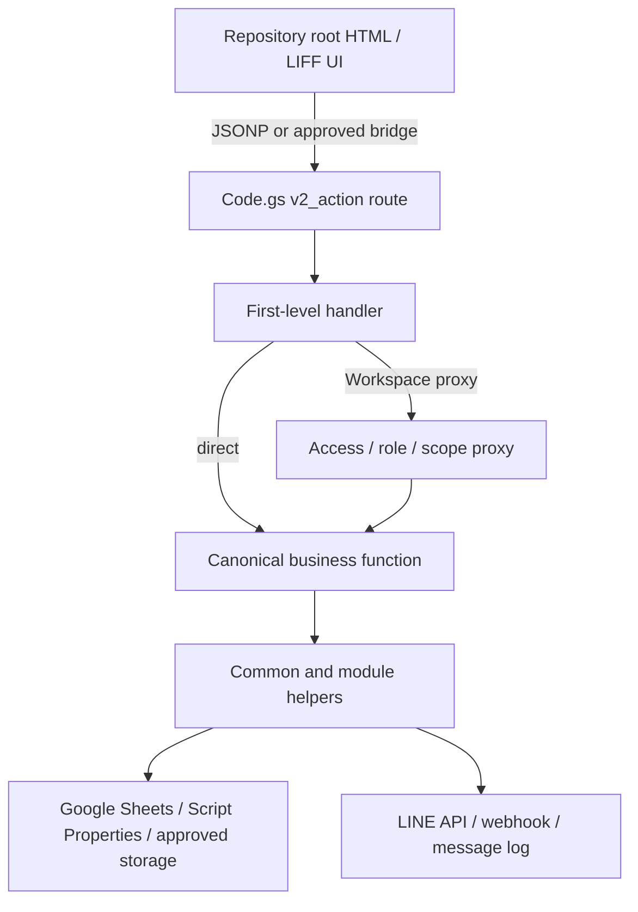
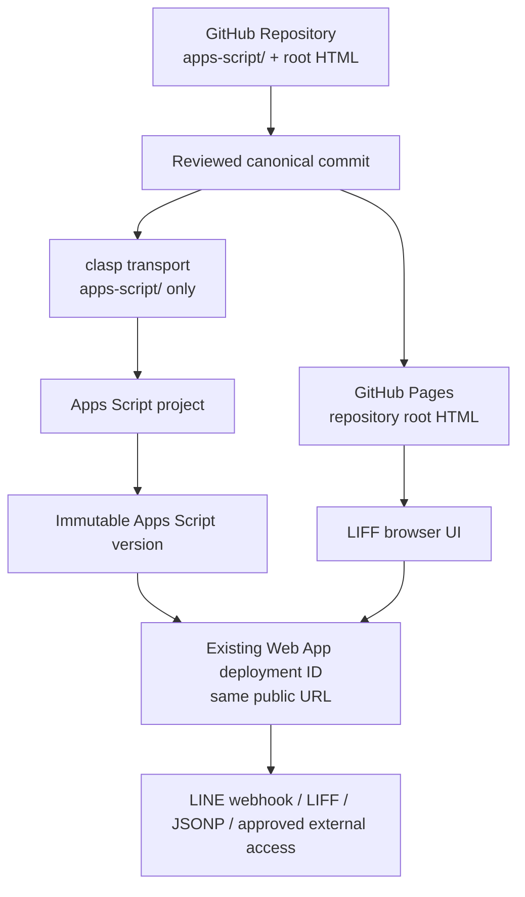

# CMWebs V2 Canonical Repository Specification

- 文件日期：2026-07-19
- 文件狀態：Proposed canonical specification；等待人工核准與執行
- 依據：`docs/22-BASELINE-DIFF-REPORT.md`、`docs/23-CANONICAL-MERGE-PLAN.md`、`docs/24-CANONICAL-MERGE-EXECUTION-CHECKLIST.md`
- 適用範圍：CMWebs 智慧租管 V2 Production Consolidation／Gate 0

本文件定義 CMWebs V2 repository 的正式 ownership、目標結構、runtime dependency、部署拓樸與未來開發規則。它是架構規格，不是 merge 指令；本文建立時不執行任何檔案整併、route 變更、Apps Script push/deploy、Google Sheets 寫入或 runtime 設定變更。

文中的「必須」、「不得」是 canonical repository 的必要條件；「建議」仍須經人工核准後才能實作。

## Canonical Source Definition

### Source roles and priority

| Source | 現階段角色 | Consolidation 期間優先級 | Gate 0 後角色 | 可用方式 | 不得作為 |
|---|---|---:|---|---|---|
| GitHub repository root | 44 個 HTML 的現行正式來源；目前尚缺 canonical Apps Script | Frontend：1；Backend：待建立 | 唯一可 review、重建、驗證與發布的 canonical source | 正式 HTML、未來 `apps-script/`、manifest、validator、docs | 不得以 `_deployed/` 或 candidate 目錄代替正式 ownership |
| `_deployed/apps-script` | 實際部署內容的 recovery baseline；唯一包含完整 68-route runtime dependency 的來源 | Backend recovery：1 | Immutable snapshot／production provenance／rollback evidence | 逐檔內容恢復、hash 對帳、deployment reconciliation | Gate 0 後不得直接作日常開發或 `clasp push` source |
| `_handoff/cmwebs-codex-handoff-2026-07-18/candidate-overlay` | 過去候選內容；21 個 Apps Script 為 deployed 子集，26 個 HTML 無 candidate-only 頁 | Comparison：3 | Read-only provenance／HTML rollback artifact | 驗證 shared module 相同內容、保存 `tenant-home`／`tenant-bills` 候選行為 | 不得單獨部署、不得覆蓋 repository、不得因檔名或時間推定較新 |

### Priority interpretation

1. **目前 backend recovery**：以 `_deployed/apps-script` 的實際內容為恢復輸入，因 repository 尚無完整 Apps Script，candidate 也缺 runtime dependency。
2. **目前 frontend**：以 repository root 為 canonical baseline；candidate 的 24 個相同頁只提供內容驗證，兩個衝突頁依既有人工決策處理。
3. **Gate 0 完成後**：repository 的 `apps-script/` 與 root HTML 成為唯一 canonical source。Deployed snapshot 用來核對「實際運行內容」，不再反向成為開發來源。
4. **任何衝突**：不得單純用來源優先級、自動覆蓋、檔名、檔案大小或修改時間選版；必須比對內容、route、handler、dependency、行為與回歸證據。
5. **Production drift**：若 live Apps Script 與 repository canonical commit 不同，停止 promotion，建立 reconciliation 記錄並由人工決定；不得直接 pull 後覆蓋 repository。

### Target canonical layout

```text
cmwebs-liff/
├── apps-script/
│   ├── Code.gs
│   ├── TESTS.gs
│   ├── V2_*.gs
│   └── appsscript.json
├── docs/
├── scripts/
├── *.html                  # GitHub Pages canonical root
├── package.json
└── production-manifest.json
```

- `apps-script/` 是唯一 canonical backend source root。
- Repository root 是 Gate 0 的唯一 canonical frontend source root；本階段不搬到 `public/`。
- `_deployed/` 與 `_handoff/` 是 snapshot/provenance，不得放入 deployment push set。
- `.clasp.json` 是 deployment binding，不是業務 source；是否提交及其位置須另由安全／部署政策核准。實際 `scriptId` 不得寫入公開文件或 log。
- 每個 canonical Apps Script basename 只能存在一次；不得同時保留 `.js` 與 `.gs` 版本。

## Apps Script Module Ownership

### Status vocabulary

| Canonical Status | 定義 |
|---|---|
| `Canonical` | 正式 repository 應擁有的唯一實作；可能是 production runtime、manifest 或受控診斷支援。 |
| `Legacy` | 為現行相容性暫時保留；不得作新功能範本，必須有 caller、owner、退出條件與 rollback。 |
| `Migration Only` | 只允許在備份、preview、人工批准與 audit 下執行；不得作一般 route／trigger runtime。 |
| `Deprecated Candidate` | Candidate overlay 中的來源副本不具正式 ownership；內容可作 provenance，但不得直接部署或與 canonical 並存。 |

「Deprecated Candidate」只表示候選**來源副本**不再是部署來源，不表示該模組的 canonical 功能已淘汰。

### Dispatcher and common runtime

| Module | Current Location | Canonical Status | Runtime Required | Migration Status | Notes |
|---|---|---|---|---|---|
| `Code.gs` | `_deployed/apps-script/程式碼.js`；candidate `Code.gs` 相同 | Canonical | Yes | P0 restore／rename | 唯一 dispatcher；68 個 `v2_action`、`doGet`、`doPost`。不得保留第二份 `程式碼.js`。硬編碼 credentials 不得進 canonical source。 |
| `V2_API.gs` | `_deployed/apps-script/V2_API.js` | Canonical | Yes | P0 restore | 擁有 JSONP、bridge、webhook、LINE、sheet/access-log helper，以及 tenant home/bills 與部分正式 handler。Legacy 子區塊另依下表管理。 |
| `appsscript.json` | `_deployed/apps-script/appsscript.json` | Canonical | Yes | P0 restore | 保存 V8、timezone 與 Web App 設定；部署時須與 live project 對帳。 |

### Workspace, team and access modules

| Module | Current Location | Canonical Status | Runtime Required | Migration Status | Notes |
|---|---|---|---|---|---|
| `V2_WORKSPACES.gs` | Deployed；candidate 相同 | Canonical | Yes | P0 restore | Workspace context；`workspace_id` 為 scope 主鍵。 |
| `V2_WORKSPACE_CREATION.gs` | Deployed；candidate 相同 | Canonical | Yes | P0 restore | 建立額外 Workspace。 |
| `V2_WORKSPACE_LANDLORD_ACCESS.gs` | Deployed；candidate 相同 | Canonical | Yes | P0 restore | Workspace access、角色、native/legacy proxy；proxy 不得繞過 scope。 |
| `V2_WORKSPACE_DASHBOARD_NATIVE.gs` | Deployed／candidate 功能相同 | Canonical | Yes | P0 restore | Native home、arrears、tenants；只保留一份。 |
| `V2_WORKSPACE_OPERATION_AUDIT.gs` | Deployed；candidate 相同 | Canonical | Yes | P0 restore | 寫入操作 audit。 |
| `V2_WORKSPACE_NOTIFICATIONS.gs` | Deployed；candidate 相同 | Canonical | Yes | P0 restore | 通知中心、偏好與 `DocumentLock`；偏好關閉只停 LINE push。 |
| `V2_TEAM_MANAGEMENT.gs` | Deployed；candidate 相同 | Canonical | Yes | P0 restore | 團隊角色、邀請與手機處理。 |

### Landlord and tenant modules

| Module | Current Location | Canonical Status | Runtime Required | Migration Status | Notes |
|---|---|---|---|---|---|
| `V2_LANDLORD_MANAGEMENT.gs` | Deployed；candidate 相同 | Canonical | Yes | P0 restore | Landlord identity 與相容資料。 |
| `V2_LANDLORD_ONBOARDING.gs` | Deployed；candidate 相同 | Canonical | Yes | P0 restore | Multi-workspace onboarding。 |
| `V2_TENANT_BINDING_PHONE.gs` | `_deployed/apps-script/V2_TENANT_BINDING_PHONE.js` | Canonical | Yes | P0 restore | Binding routes、台灣手機正規化、跨表同步；repair 必須受控。 |
| `V2_TENANT_LEASE_ONBOARDING.gs` | `_deployed/apps-script/V2_TENANT_LEASE_ONBOARDING.js` | Canonical | Yes | P0 restore | Tenant create、Workspace permission、lease/view sync。 |
| `V2_TENANT_PAYMENT_REPORTS.gs` | Deployed；candidate 相同 | Canonical | Yes | P1 verify | 房客付款回報與團隊通知。 |
| `V2_TENANT_MESSAGES.gs` | Deployed；candidate 相同 | Canonical | Yes | P1 verify | 房客訊息及現行報修基礎；本規格不新增報修功能。 |
| `V2_TENANT_CHECKIN_MANAGEMENT.gs` | Deployed；candidate 相同 | Canonical | Yes | P1 verify | 房客報到、歡迎訊息與團隊／LINE failure 通知。 |
| `V2_CONTRACT_REQUESTS.gs` | Deployed；candidate 相同 | Canonical | Yes | P1 verify | 合約申請、狀態更新與團隊通知。 |

### Property, settings and billing modules

| Module | Current Location | Canonical Status | Runtime Required | Migration Status | Notes |
|---|---|---|---|---|---|
| `V2_SYSTEM_SETTINGS.gs` | Deployed；candidate 相同 | Canonical | Yes | P0 restore | Settings、手機前導 0、催繳設定、通知偏好。 |
| `V2_SETTINGS_INTEGRATION.gs` | Deployed；candidate 相同 | Canonical | Yes | P0 restore | 將 Workspace 帳務預設接入房間、帳單、催繳。 |
| `V2_PROPERTY_ROOM_MANAGEMENT.gs` | Deployed；candidate 相同 | Canonical | Yes | P0 restore | 房源／房間、押金預設、動態夏月。 |
| `V2_BILLING_MANAGEMENT.gs` | Deployed；candidate 相同 | Canonical | Yes | P0 restore | 帳單、上期電表 null 修正、Workspace 預設。 |
| `V2_BILL_NOTIFICATIONS.gs` | Deployed；candidate 相同 | Canonical | Yes | P0 restore | 帳單通知。 |
| `V2_AUTO_PAYMENT_REMINDER.gs` | Deployed；candidate 相同 | Canonical | Yes | P0 restore | Workspace 排程、timezone/hour/days、final+1 人工處理。 |

### Payment and settlement modules

| Module | Current Location | Canonical Status | Runtime Required | Migration Status | Notes |
|---|---|---|---|---|---|
| `V2_PAYMENT_SETTLEMENT.gs` | `_deployed/apps-script/V2_PAYMENT_SETTLEMENT.js` | Canonical | Yes | P1 restore／verify | `landlord_payment_report_settle` proxy 的正式第二層 dependency。 |
| `V2_MANUAL_SETTLEMENT.gs` | `_deployed/apps-script/V2_MANUAL_SETTLEMENT.js` | Canonical | Yes | P1 restore／verify | 手動銷帳、audit 與 legacy sync。 |
| `V2_PAYMENT_REVERSAL.gs` | `_deployed/apps-script/V2_PAYMENT_REVERSAL.js` | Canonical | Yes | P1 restore／verify | 撤銷已繳、void payment、恢復欠款。 |
| `V2_PAID_BILL_MANAGEMENT.gs` | `_deployed/apps-script/V2_PAID_BILL_MANAGEMENT.js` | Canonical | Yes | P1 restore／verify | 已繳帳單統一查詢。 |

### Notifications, migration and tests

| Module | Current Location | Canonical Status | Runtime Required | Migration Status | Notes |
|---|---|---|---|---|---|
| `V2_ANNOUNCEMENT_MANAGEMENT.gs` | Deployed；candidate 相同 | Canonical | Yes | P1 verify | 公告、retry、容量整理與團隊結果通知。 |
| `V2_LEGACY_BILL_IMPORT.gs` | `_deployed/apps-script/V2_LEGACY_BILL_IMPORT.js` | Migration Only | No | P2 controlled classification | V1 歷史帳單 preview/import；Schema snapshot、備份、月份範圍與批准前不得執行。 |
| `TESTS.gs` | `_deployed/apps-script/TESTS.js` | Canonical | No | P2 controlled restore | 診斷／回歸線索；先標記寫入、LINE、trigger、repair 等副作用，不能把 production 特定 ID 當通用測試。 |

### Legacy and deprecated ownership

| Module | Current Location | Canonical Status | Runtime Required | Migration Status | Notes |
|---|---|---|---|---|---|
| Legacy dashboard handlers | `V2_API.js` 內部 | Legacy | Conditional | P2 route-by-route decision | Native dashboard 已由 Workspace module 擁有；未確認 caller 與回歸前不得刪除 common runtime helper。 |
| V1 paid／monthly sync utilities | `V2_API.js`、settlement／reversal modules 內部 | Legacy | Conditional | P2 classify as runtime／migration／rollback | 必須保留 audit、idempotency 與資料一致性證據；不得直接移除 legacy 欄位。 |
| Candidate shared Apps Script copies（21） | `candidate-overlay/apps-script/Code.gs` 與 shared `V2_*.gs` | Deprecated Candidate | No | Do not copy／do not deploy | 與 deployed 相同或只差 EOF；保存 hash 作 provenance，不能與 canonical 同時載入。 |
| Candidate-incomplete backend as a set | `candidate-overlay/apps-script` | Deprecated Candidate | No | Permanently excluded as standalone baseline | 缺 9 個 deployed-only modules、6 個直接 handler、6 個 proxy dependency 與 common helpers。 |

### Ownership invariants

- `Code.gs` 是唯一 route dispatcher；任何其他模組不得另建 route table、`doGet` 或 `doPost`。
- 每個 top-level function、`const`、`let`、`var` 在整個 Apps Script global scope 只能宣告一次。
- 30 個 canonical `.gs` 程式檔各有唯一 owner；`appsscript.json` 另作唯一 manifest。
- `V2_API.gs` 可以在 P2 拆分，但拆分前後 JSONP、bridge、webhook、LINE、sheet/access-log 與所有 caller dependency 必須完整。
- `landlord_id` 暫作相容欄位；所有新 authorization、read/write scope 以 `workspace_id` 為主。
- LINE token、Spreadsheet ID、付款 credential 與其他 secrets 只能存在 Apps Script Properties／核准的 secure store，不能出現在 source、文件或 log。

## HTML Ownership Map

### Decision vocabulary

- `Repository canonical`：保留 repository root 內容，不以 candidate 重複覆蓋。
- `Repository behavior`：已對 conflict 做行為決策，但仍須完成指定回歸。
- `Retain / usage review`：Gate 0 不刪除；P2 依實際入口、traffic、route 與替代頁決定正式／legacy／retired。
- `Legacy filename exception`：暫存既有入口，不允許它成為未來命名範本。

| HTML | Repository Status | Candidate Status | Canonical Decision | Migration Action |
|---|---|---|---|---|
| `announce.html` | Present；usage review | Missing | Retain / usage review | Gate 0 保留；盤點入口與替代頁。 |
| `batch-meter.html` | Present；usage review | Missing | Retain / usage review | Gate 0 保留；確認是否仍有正式 caller。 |
| `checkout.html` | Present；usage review | Missing | Retain / usage review | Gate 0 保留；本規格不新增退租功能。 |
| `hub.html` | Present；usage review | Missing | Retain / usage review | Gate 0 保留；盤點入口。 |
| `identity.html` | Present；usage review | Missing | Retain / usage review | Gate 0 保留；盤點身份流程。 |
| `index.html` | Present entry | Missing | Retain / usage review | 維持現行 GitHub Pages 路徑並驗證入口。 |
| `landlord-activity.html` | Present；linked dependency | Missing | Repository canonical | 保留並做 loading／link test。 |
| `landlord-announcements.html` | Present | SAME | Repository canonical | 不覆蓋；保存相同內容的 provenance。 |
| `landlord-arrears.html` | Present | SAME | Repository canonical | 不覆蓋；忽略純 EOF 差異。 |
| `landlord-bill-notifications.html` | Present | SAME | Repository canonical | 不覆蓋。 |
| `landlord-billing.html` | Present | SAME | Repository canonical | 不覆蓋。 |
| `landlord-contract-requests.html` | Present | SAME | Repository canonical | 不覆蓋。 |
| `landlord-entry.html` | Present | SAME | Repository canonical | 保留登入後返回原頁並回歸。 |
| `landlord-home.html` | Present | SAME | Repository canonical | 不覆蓋。 |
| `landlord-join.html` | Present | SAME | Repository canonical | 不覆蓋。 |
| `landlord-line-logs.html` | Present；linked dependency | Missing | Repository canonical | 保留並做 loading／link／route test。 |
| `landlord-messages.html` | Present；linked dependency | Missing | Repository canonical | 保留並做 loading／link／route test。 |
| `landlord-more.html` | Present | SAME | Repository canonical | 不覆蓋；驗證其 7 個 repository-only links。 |
| `landlord-notifications.html` | Present | SAME | Repository canonical | 不覆蓋。 |
| `landlord-onboarding.html` | Present | SAME | Repository canonical | 不覆蓋。 |
| `landlord-paid-bills.html` | Present；linked dependency | Missing | Repository canonical | 保留並做 loading／payment route test。 |
| `landlord-payment-reports.html` | Present；linked dependency | Missing | Repository canonical | 保留並做 loading／payment route test。 |
| `landlord-properties.html` | Present | SAME | Repository canonical | 不覆蓋。 |
| `landlord-register.html` | Present | SAME | Repository canonical | 不覆蓋。 |
| `landlord-registry.html` | Present；usage review | Missing | Retain / usage review | Gate 0 保留；盤點用途。 |
| `landlord-settings.html` | Present；linked dependency | Missing | Repository canonical | 保留並做 loading／settings route test。 |
| `landlord-team.html` | Present | SAME | Repository canonical | 不覆蓋；忽略純 EOF 差異。 |
| `landlord-tenant-checkin.html` | Present | SAME | Repository canonical | 不覆蓋。 |
| `landlord-tenant-create.html` | Present | SAME | Repository canonical | 不覆蓋；必須配合 restored onboarding handlers。 |
| `landlord-tenant-detail.html` | Present | SAME | Repository canonical | 不覆蓋。 |
| `landlord-tenants.html` | Present | SAME | Repository canonical | 不覆蓋。 |
| `landlord-workspaces.html` | Present；linked dependency | Missing | Repository canonical | 保留並做 loading／workspace route test。 |
| `landlord.html` | Present legacy page | Missing | Retain / usage review | Gate 0 保留；與 native landlord flow 分類。 |
| `meter.html` | Present；usage review | Missing | Retain / usage review | Gate 0 保留；盤點用途。 |
| `new-lease.html` | Present；forbidden-name legacy exception | Missing | Legacy filename exception | Gate 0 不刪；P2 決定 usage／canonical replacement／rename／retirement，更新所有入口後才處理舊檔。 |
| `tenant-bills.html` | Present | CONFLICT | Repository behavior（provisional） | 暫採 full-height modal、overscroll containment、scroll reset；iOS／Android LINE WebView 失敗時回復 candidate bottom-sheet artifact 並重新決策。 |
| `tenant-bind.html` | Present | SAME | Repository canonical | 不覆蓋。 |
| `tenant-checkin.html` | Present；usage review | Missing | Retain / usage review | Gate 0 保留；盤點用途。 |
| `tenant-contract.html` | Present | SAME | Repository canonical | 不覆蓋。 |
| `tenant-home.html` | Present | CONFLICT | Repository behavior | 保留未綁定導向 `tenant-bind.html` 與帳單月份格式化；保存 candidate hash 作 rollback。 |
| `tenant-message.html` | Present | SAME | Repository canonical | 不覆蓋。 |
| `tenant-payment-report.html` | Present | SAME | Repository canonical | 不覆蓋。 |
| `tenant-renewal.html` | Present | SAME | Repository canonical | 不覆蓋。 |
| `tenant-termination.html` | Present | SAME | Repository canonical | 不覆蓋；本規格不擴充退租功能。 |

HTML ownership invariants：

- 現行 44 個 repository HTML 在 Gate 0 全部保留；Candidate-only HTML 為 0。
- Candidate 已收錄的 24 個 SAME 頁不產生覆蓋 diff。
- Candidate 導覽依賴但未收錄的 7 頁必須保留並完成 link/loading test。
- `tenant-home.html` 與 `tenant-bills.html` 的 candidate 內容只作 rollback artifact，不作第二份 canonical 檔。
- 新頁不得複製並硬編碼不同 API URL、LIFF ID 或 test UID；環境設定集中化屬 P2 受控變更。

## Runtime Dependency Graph

### Canonical request chain



Dependency labels：

- **必要 dependency**：route、handler、business function 或 helper 沒有它就無法完成 response、authorization、資料讀寫或外部整合。
- **Proxy dependency**：第一層 Workspace proxy 已存在，但必須再委派到一個正式 business function；proxy 本身不代表功能完整。
- **Missing dependency**：route 名稱存在，但 direct handler、proxy target 或共用 helper 不存在。Canonical baseline 的 missing dependency 必須為 0。

### Necessary dependencies

| From | Required dependency | Type | Canonical owner |
|---|---|---|---|
| HTML JSONP request | `Code.gs` route + `jsonOutput_` | Necessary | `Code.gs` + `V2_API.gs` |
| Approved bridge request | `htmlBridgeOutput_` | Necessary | `V2_API.gs` |
| `doPost` LINE webhook | `handleLineWebhook_` | Necessary | `V2_API.gs` |
| LINE notification/log | `pushLineTextMessage_`、`cmwebsLogLineMessage_` | Necessary | `V2_API.gs` + notification modules |
| Sheet-backed handlers | `getSheetObjects_`、scope/permission helpers | Necessary | `V2_API.gs` + owning module |
| LIFF access audit | `logLiffAccess_` | Necessary | `V2_API.gs` |
| Any write operation | Workspace、role、permission check + operation audit | Necessary | Access module + owning business module + audit module |
| Secrets/config access | Named Script Properties | Necessary | Runtime configuration；values never in repository |

### Proxy dependencies

| Route | Workspace proxy | Required business function | Owner |
|---|---|---|---|
| `landlord_line_logs` | `getWorkspaceLandlordLineLogsByLineUid_` | `getLandlordLineLogsByLineUid` | `V2_API.gs` |
| `landlord_send_tenant_message` | `workspaceLandlordSendTenantMessageByLineUid_` | `landlordSendTenantMessageByLineUid_` | `V2_API.gs` |
| `landlord_payment_report_settle` | `settleWorkspaceLandlordPaymentReportByLineUid_` | `settleLandlordPaymentReportByLineUid_` | `V2_PAYMENT_SETTLEMENT.gs` |
| `landlord_bill_manual_settle` | `manualSettleWorkspaceLandlordBillByLineUid_` | `manualSettleLandlordBillByLineUid_` | `V2_MANUAL_SETTLEMENT.gs` |
| `landlord_bill_reopen` | `reopenWorkspaceLandlordBillByLineUid_` | `reopenLandlordBillByLineUid_` | `V2_PAYMENT_REVERSAL.gs` |
| `landlord_paid_bills_init` | `getWorkspaceLandlordPaidBillsInitByLineUid_` | `getLandlordPaidBillsInitByLineUid_` | `V2_PAID_BILL_MANAGEMENT.gs` |

### Candidate missing dependencies to eliminate in canonical source

| Missing class | Affected routes/functions | Canonical resolution |
|---|---|---|
| Direct handler | `tenant_binding_status` → `getTenantBindingStatusByLineUid_` | Restore `V2_TENANT_BINDING_PHONE.gs`. |
| Direct handler | `tenant_bind_submit` → `bindTenantByLineUid_` | Restore `V2_TENANT_BINDING_PHONE.gs`. |
| Direct handler | `landlord_tenant_create_init` → `getLandlordTenantCreateInitByLineUid_` | Restore `V2_TENANT_LEASE_ONBOARDING.gs`. |
| Direct handler | `landlord_tenant_create` → `createLandlordTenantLeaseByLineUid_` | Restore `V2_TENANT_LEASE_ONBOARDING.gs`. |
| Direct handler | `tenant_home` → `getTenantHomeByLineUid` | Restore `V2_API.gs`. |
| Direct handler | `tenant_bills` → `getTenantBillsByLineUid` | Restore `V2_API.gs`. |
| Proxy target | 上節 6 個 Workspace proxy targets | Restore `V2_API.gs` 與 4 個 payment modules。 |
| Common helper | JSONP、bridge、webhook、LINE、sheet/access-log helpers | Restore `V2_API.gs`，並在任何未來拆分後重新跑 dependency validation。 |

## Deployment Topology

### Canonical topology



線性責任鏈為：

```text
GitHub Repository
↓ reviewed canonical commit
clasp
↓ apps-script push set
Apps Script project
↓ immutable version
existing Web App deployment
↓ unchanged Web App URL
LINE / LIFF / approved external access
```

Deployment invariants：

- GitHub repository 是 source of truth；`clasp` 只負責傳輸，不決定版本內容。
- `clasp push` 只能包含 canonical `apps-script/`；不得包含 `_deployed/`、candidate、docs、backup 或 secrets。
- 每次 backend release 建立新的 immutable Apps Script version，並更新**既有** deployment ID；不得建立新的正式 Web App URL。
- GitHub Pages 與 Apps Script 分別部署，但必須能追溯到相容的 repository commit／Apps Script version。
- Deployment ID、Script Properties 值與 credentials 存於安全紀錄，不寫入本文件。
- 任何 push/deploy、trigger、Properties、Sheet migration 都需要 checklist gate 與即時人工批准。

## Future Development Rules

### New Apps Script modules

1. 正式模組只能新增於 `apps-script/`，副檔名使用 `.gs`。
2. Dispatcher 固定為 `Code.gs`；其他檔案不得宣告 `doGet`、`doPost` 或第二份 route map。
3. 業務模組使用穩定、功能導向的 `V2_<DOMAIN>_<CAPABILITY>.gs` 名稱；不得用 `_FIXED`、`_WITH_*`、`final-*`、`complete-*`、`new-*` 或日期 suffix 表示版本。
4. 一個 top-level symbol 只有一個 owner；新增前必須掃描全部 canonical `.gs`。
5. 新模組必須在 ownership spec／manifest、受影響 API 文件與 test matrix 登錄，並指定 runtime owner、data scope、side effects 與 rollback。
6. 所有寫入入口必須驗證 Workspace、角色與權限；不得把 `landlord_id` 當新架構唯一 scope key。
7. 不得在主流程持有 `ScriptLock` 時，再由通知模組取得同一把 `ScriptLock`。

### New HTML files

1. Gate 0 期間新正式 HTML 位於 repository root；除非另有核准的整體 hosting migration，不新增平行 `public/` canonical tree。
2. 檔名使用小寫 kebab-case 與實際用途，例如 `landlord-paid-bills.html`；不得使用 `new-*`、`final-*`、`*-fixed.html` 或其他版本式命名。
3. 每個頁面必須登錄角色、入口、linked routes、back/return behavior 與 owner。
4. 必須保留固定 shell、`--app-height`、bottom nav、safe-area、modal z-index 與頁底空間規則。
5. API URL、LIFF ID、test UID 與 runtime environment 不得在每頁各自新增不同值；集中設定變更須另案 review。
6. 新增或改名頁面時必須更新所有內部 link、LIFF entry 與 HTML completeness test，並保留舊入口 migration／redirect 計畫。

### Route naming and ownership

1. V2 route 使用穩定的 lower snake_case `v2_action` 名稱，例如 `landlord_payment_report_settle`。
2. Route name 應表達 actor／resource／operation，不得以檔案版本、日期或 UI 細節命名。
3. Route 只能在 `Code.gs` 宣告，且必須對應唯一第一層 handler。
4. 新 route 必須同步更新 `docs/04-API-ROUTES.md`、handler/dependency validation 與 `docs/09-TEST-MATRIX.md`。
5. 寫入 route 必須記錄 Workspace、actor、target、result；不可依 `test=1` 當 dry-run 或跳過權限。
6. Route removal 必須先證明 HTML／LIFF／external caller 為 0，並有相容期與 rollback。

### Proxy rules

1. Proxy 的目的只限 Workspace context、membership、role/permission 與 legacy compatibility boundary。
2. Proxy 必須明確委派到已存在的 business handler；不得用空 proxy、動態名稱或 silent fallback 掩蓋 missing dependency。
3. Proxy 不得複製 settlement、billing、notification 等業務規則；business function 保持唯一 owner。
4. Static validation 必須解析 proxy 的第二層 dependency；只驗證第一層 handler 不算完整。
5. Legacy proxy 必須記錄 caller、canonical target、退出條件與 target phase；退出前需通過跨 Workspace isolation 回歸。

### Migration rules

1. Migration／repair／import 函式必須標記為 `Migration Only` 或受控 utility，不能掛入一般 UI route、startup 或正式 recurring trigger，除非有明確 Issue 與批准。
2. 執行前必須有 production backup、Schema snapshot、preview、影響範圍、idempotency key、逐筆 audit、owner 與 rollback。
3. `test=1` 不是 dry-run；preview 必須是明確的 read-only code path，且驗證不發 LINE、不建 trigger、不寫 Sheet。
4. 未完成資料對帳前保留 legacy 欄位與 `landlord_id` 相容資料；不得整張表覆蓋或無 migration 刪欄。
5. `V2_payment_accounts` 與 `V2_workspace_payment_accounts` 必須有 mapping、masking、role policy、驗證與 rollback 後才可收斂。
6. Migration 完成後要以獨立變更決定 utility 是移出 deployment source、保留 rollback window 或正式 deprecated；不能留下未標記的 production callable code。

### Deprecated rules

1. Deprecated 只表示不再接受新 caller；不代表可立即刪除。
2. Deprecated module／function／HTML 必須記錄 owner、現有 caller、替代方案、deprecation date、removal gate 與 rollback artifact。
3. Deprecated code 不得新增功能、route 或資料 schema dependency；只允許安全修補與 migration support。
4. 刪除前必須證明 route/link/traffic/caller 為 0，更新文件與 validator，並在獨立 commit／PR 中執行。
5. Candidate overlay 永遠是 read-only provenance，不重新升格為 canonical source；若需取用其中行為，必須以內容 diff 與人工決策導入 canonical 檔。

## Validation Rules

每次 merge 前，下列項目都是 blocking gate；任一未通過不得 push 或 deploy。

### Route completeness

- [ ] `Code.gs` 是唯一 dispatcher、唯一 `doGet`、唯一 `doPost`。
- [ ] 現行 baseline 為 68 個 route、68 個 unique route、0 duplicate；若經核准新增／移除，code、`docs/04-API-ROUTES.md` 與 tests 必須在同一變更同步更新。
- [ ] 每個 HTML／LIFF action 指向已登錄 route，不存在拼字漂移或 hidden fallback。
- [ ] Route diff 有 reviewer、風險、向後相容與 rollback 說明。

### Handler completeness

- [ ] 現行 68/68 第一層 handler 均存在且名稱唯一。
- [ ] 6/6 已知 Workspace proxy 的第二層正式 handler 均存在。
- [ ] 每個寫入 handler 在 business operation 前驗證 Workspace、角色、permission 與 target ownership。
- [ ] 沒有因 Apps Script global scope 而重複的 top-level function／`const`／`let`／`var`。

### Helper completeness

- [ ] `jsonOutput_`、`htmlBridgeOutput_`、`handleLineWebhook_` 存在。
- [ ] `pushLineTextMessage_`、`cmwebsLogLineMessage_`、`getSheetObjects_`、`logLiffAccess_` 存在。
- [ ] Static dependency scan 能解析 direct、proxy、business 與 common helper，不只計算 route 數。
- [ ] Common helper owner 唯一，沒有 deployed/candidate `.js`／`.gs` 疊加。
- [ ] Secrets scan 為 0；Properties inventory 只列 key name，不輸出 value。

### HTML link completeness

- [ ] 現行 repository root 44/44 HTML 可載入，或每個未發布 legacy exception 有核准文件。
- [ ] Internal HTML missing link = 0；candidate 既有導覽依賴的 7 個 repository-only 頁全部可達。
- [ ] 24 個 SAME 頁沒有無意義 candidate overwrite。
- [ ] `tenant-home.html` binding redirect／月份格式化回歸通過。
- [ ] `tenant-bills.html` 在 iOS／Android LINE WebView 通過 fixed shell、scroll、modal、bottom nav 與 safe-area 驗收。
- [ ] 登入後返回原頁、JSONP callback cleanup、loading／empty／error／timeout state 可恢復。

### Workspace isolation

- [ ] 所有 property、room、tenant、contract、bill、payment、message、notification query 都限制目前 Workspace。
- [ ] Owner／admin／manager／accountant／maintenance／viewer 權限符合文件；無權限角色只能看到遮罩銀行帳號。
- [ ] Workspace switch 後所有 dashboard、tenant、message、payment scope 同步切換。
- [ ] 不同 Workspace 的相同手機號碼不會造成 membership 或 tenant binding 越權。
- [ ] Settlement、manual settle、reversal、paid-bill query 都拒絕 cross-Workspace target。
- [ ] Legacy principal-landlord compatibility path 不能繞過 Workspace access。
- [ ] 每個受控寫入有完整 actor／membership／workspace／target／result audit。

### Rollback readiness

- [ ] 記錄 current canonical commit、deployed snapshot hash、current Apps Script version、previous known-good version、existing deployment ID 與 Web App URL；敏感 ID 放安全紀錄。
- [ ] 保存 `tenant-home.html`、`tenant-bills.html` repository/candidate artifact 與 hash。
- [ ] 保存 trigger inventory、Script Properties key inventory、Schema snapshot；不記錄 secret value。
- [ ] Backend rollback 可把既有 deployment 指回 previous known-good version且 URL 不變。
- [ ] Frontend rollback 可回復 previous known-good GitHub Pages commit。
- [ ] 任何 Sheet migration 可依逐筆 audit 還原，不以整張表無條件覆蓋。
- [ ] Rollback owner、觸發條件、smoke test 與 evidence location 已確認。
- [ ] `npm run validate`、受影響 Apps Script 測試與核心 flow 回歸都有可審查結果；有副作用的測試只用受控帳號並另行批准。

## Canonical Decision Summary

| Area | Recommended canonical decision |
|---|---|
| Backend source | 在 repository 建立唯一 `apps-script/`，以 deployed 30 個程式檔正規化為 `.gs` 的內容作 recovery baseline。本文不執行該 merge。 |
| Dispatcher | 唯一 `apps-script/Code.gs`；維持目前 68-route baseline，禁止第二份 dispatcher。 |
| Runtime dependencies | 完整保留 `V2_API`、tenant binding/onboarding 與四個 payment dependency；canonical missing dependency 必須為 0。 |
| Frontend source | Repository root 的 44 個 HTML；candidate 沒有 canonical ownership。 |
| HTML conflicts | `tenant-home.html` 採 repository 行為；`tenant-bills.html` 暫採 repository 行為，需實機通過才能 promotion。 |
| Repository-only HTML | Gate 0 全部保留；7 個 link dependencies 優先驗證，其餘做 usage/legacy review。 |
| `new-lease.html` | 既有 legacy filename exception；P2 決定替代名稱、入口 migration 或 retirement，不作新命名範本。 |
| Legacy | 先保留現行 caller 所需的 Workspace proxy、V1/V2 sync 與 compatibility fields，再依 route/data evidence 逐項退出。 |
| Migration | `V2_LEGACY_BILL_IMPORT` 僅作受控 migration；任何資料寫入都需 backup、preview、idempotency、audit、批准與 rollback。 |
| Deployment | Repository commit → canonical `apps-script/` → clasp → Apps Script version → existing Web App deployment；維持 Web App URL。 |
| Candidate overlay | Read-only comparison／rollback provenance；不得直接部署或與 canonical source 疊加。 |
| Approval state | 這是推薦架構規格，尚未執行 merge、push、deploy、Sheet change、route change 或 runtime config change。 |

## 本文件建立聲明

本輪只建立：

```text
docs/25-CANONICAL-REPOSITORY-SPEC.md
```

本輪沒有修改任何 `.js`、`.gs`、`.html`、`appsscript.json`、`.clasp.json`、Google Sheet、Deployment、Route 或 Runtime 設定；沒有執行 merge、`clasp push`、`clasp deploy`、commit、push 或 branch 操作。
