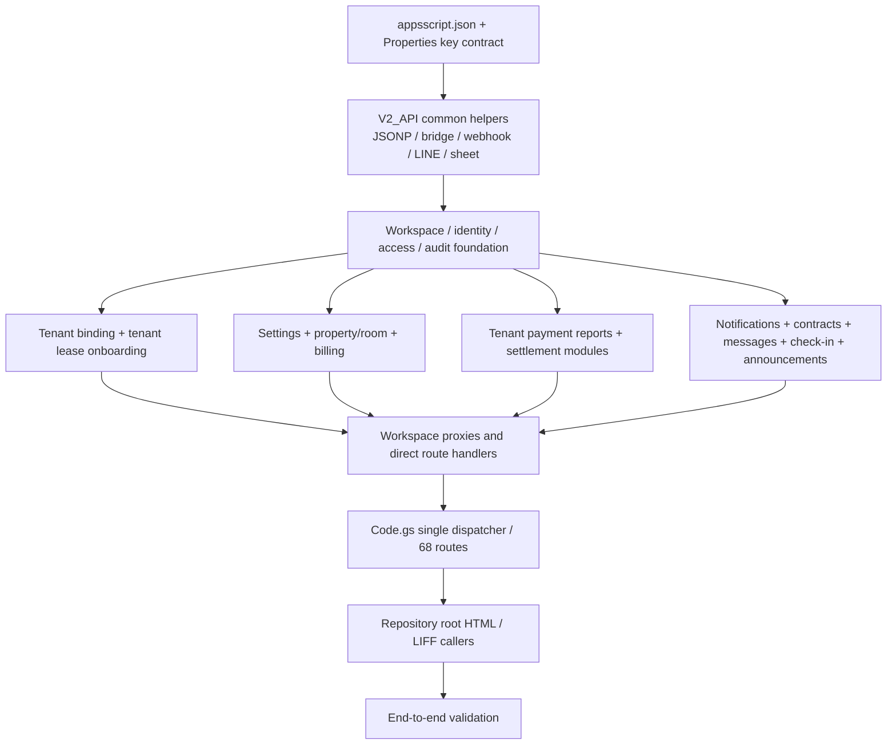

# Canonical Gap Execution Plan

- 文件日期：2026-07-19
- 文件狀態：Execution plan only；等待人工批准
- 適用範圍：CMWebs 智慧租管 V2 Production Consolidation／Gate 0
- 依據：`docs/22-BASELINE-DIFF-REPORT.md`、`docs/23-CANONICAL-MERGE-PLAN.md`、`docs/24-CANONICAL-MERGE-EXECUTION-CHECKLIST.md`、`docs/25-CANONICAL-REPOSITORY-SPEC.md`

本文件把已確認的 baseline 差異轉成有依賴順序、驗收 gate 與人工決策點的執行計畫。本文不代表已開始 merge，也不授權修改 Apps Script、HTML、Google Sheets、Deployment、Route、trigger、Properties 或任何 runtime 設定。

## 1. Current Canonical State

### 1.1 Repository

目前狀態：

- Repository root 有 44 個 HTML，是現行 GitHub Pages frontend baseline。
- Repository 尚無正式 `apps-script/` canonical backend；目前不能只靠正式 repository 重建 production Web App。
- 24 個 repository HTML 與 candidate 功能相同；2 個 HTML 有行為衝突；18 個 HTML 為 repository-only。
- `docs/22` 至 `docs/25` 已形成差異報告、merge plan、execution checklist 與 repository specification，但這些文件尚未執行 backend consolidation。
- `new-lease.html` 是既有 legacy filename exception；不得作未來 `new-*` 命名範本。

Repository 的角色：

- **現在**：frontend canonical source + 未來 backend canonical target。
- **Gate 0 後**：`apps-script/` 與 root HTML 的唯一 source of truth。
- **目前最大 gap**：沒有 30 個 canonical `.gs` 與 `appsscript.json`，因此 repository 尚不可重建完整 backend。

### 1.2 Deployed Apps Script

目前狀態：

- `_deployed/apps-script` 是 production recovery baseline。
- 包含 30 個 Apps Script 程式檔、`appsscript.json` 與 deployment binding metadata。
- `程式碼.js` 含 68 個 `v2_action`，68 個 route 均有第一層 handler。
- 6 個 Workspace proxy 的正式第二層 handler與必要共用 helper都存在。
- 包含 candidate 缺少的 9 個 deployed-only modules：
  - `V2_API`
  - `V2_TENANT_BINDING_PHONE`
  - `V2_TENANT_LEASE_ONBOARDING`
  - `V2_PAYMENT_SETTLEMENT`
  - `V2_MANUAL_SETTLEMENT`
  - `V2_PAYMENT_REVERSAL`
  - `V2_PAID_BILL_MANAGEMENT`
  - `V2_LEGACY_BILL_IMPORT`
  - `TESTS`
- `Code` 內已識別出不可進 canonical commit 的硬編碼付款 credentials；必須先輪替並改由 Apps Script Properties 讀取。
- Deployed export 使用 `.js` 與中文 `程式碼.js`，只作恢復輸入；Gate 0 後不得繼續作日常開發或直接部署來源。

Deployed 的角色：

- **現在**：backend content recovery 的第一優先依據。
- **Gate 0 後**：immutable snapshot、production reconciliation 與 rollback evidence。
- **不得**：把 `_deployed/apps-script` 直接與 candidate 疊加，或長期作 repository 外的 source of truth。

### 1.3 Candidate overlay

目前狀態：

- Candidate Apps Script 有 21 個 `.gs`；其中 20 個與 deployed 逐位元相同，`V2_WORKSPACE_DASHBOARD_NATIVE` 只差檔尾空白。
- Candidate `Code.gs` 與 deployed `程式碼.js` 相同，因此也宣告 68 個 route、0 duplicate route。
- Candidate 只具備 62/68 第一層 handler。
- Candidate 缺 6 個 direct handler、6 個 proxy 第二層 dependency，以及 JSONP、bridge、webhook、LINE、sheet/access-log 共用 helper。
- Candidate 缺少上節 9 個 deployed-only modules，不能單獨作可部署 backend。
- Candidate public 有 26 個 HTML：24 個與 repository 功能相同，`tenant-home.html`、`tenant-bills.html` 兩個有行為衝突；candidate-only HTML 為 0。
- Candidate public 會連到 7 個自身未收錄、但 repository 已存在的頁面；單獨部署 candidate 會斷鏈。

Candidate 的角色：

- **現在與未來**：read-only comparison/provenance，以及兩個 HTML conflict 的 rollback artifact。
- **不得**：單獨部署、直接覆蓋 repository，或與 deployed/canonical 同名模組並存於 Apps Script global scope。

### 1.4 Three-source gap summary

| Area | Repository | Deployed | Candidate | Canonical gap |
|---|---|---|---|---|
| Apps Script source | Missing | 30 scripts，完整 recovery baseline | 21 scripts，不完整子集 | Repository 必須建立唯一 `apps-script/`。 |
| Route table | Missing | 68 unique routes | 68 unique routes | `Code.gs` 尚未進正式 repository。 |
| First-level handler | Missing | 68/68 | 62/68 | Canonical target 必須達 68/68。 |
| Proxy dependency | Missing | 6/6 | 0/6 正式 target 缺失 | 必須恢復 `V2_API` 與 4 個 payment modules。 |
| Common runtime helper | Missing | Complete | Missing | 必須恢復 `V2_API` 或等價、完整且唯一的 owner。 |
| Apps Script manifest | Missing | Present | Missing | `appsscript.json` 必須納入 canonical source。 |
| HTML | 44 | None | 26 | Repository root 維持 canonical；不得用 candidate subset 取代。 |
| HTML conflicts | 2 canonical decisions待驗收 | N/A | 2 rollback variants | `tenant-home` 需批准；`tenant-bills` 需實機決定 final promotion。 |
| Secrets/config | 尚未建立 canonical backend | Live/export 有暴露風險 | Candidate copy 有相同風險 | 先輪替並移至 Properties；值不得進 Git／文件／log。 |
| Deployability from repository | No | Live snapshot only | No | Gate 0 完成前無單一可重建 source。 |

## 2. Missing Function Inventory

Priority 定義：

- **P0 — Production blocker**：缺少時 repository 無法重建 production runtime、route dependency 不完整、可能洩漏 secret，或沒有可用 rollback point。
- **P1 — Core workflow incomplete**：檔案可能存在，但尚未完成核心業務、mobile、Workspace、LINE 或資料一致性驗收。
- **P2 — Optimization / cleanup**：不阻擋第一個完整 baseline，但會影響長期 ownership、legacy 收斂、validator 強度與維護安全。

同一 module 可能同時有 P0「恢復檔案」與 P1「驗證行為」工作；兩者不得合併為一個已完成狀態。

### 2.1 P0 — Production blocker

| Module | Priority | Missing Component | Impact | Required Action | Risk |
|---|---|---|---|---|---|
| Canonical `apps-script/` | P0 | Repository 缺完整 backend source root | 無法由 repository 重建 Web App；production drift 無法可靠 review | 依 25 spec 建立唯一目錄，正規化 30 個 deployed scripts 與 manifest；本文件不執行 | 大規模一次性匯入可能混入 secrets、duplicate 或未審核變更 |
| `Code.gs` | P0 | Repository 缺唯一 dispatcher | 68 routes、`doGet`、`doPost` 無 canonical owner | 以已確認相同的 deployed `程式碼.js`／candidate `Code.gs` 為內容基準，正規化為唯一 `Code.gs` | 同時保留兩份會重複 route、function、const；credentials 可能被提交 |
| `Code.gs` configuration | P0 | Payment credentials 尚未改由安全 Properties 提供 | Credential 暴露；canonical source 不可安全提交 | 輪替已暴露 credential，定義 Properties key contract，source secret scan = 0 | 錯誤輪替可中斷付款；舊 credential 不得作 rollback |
| `V2_API.gs` | P0 | JSONP／bridge／webhook／LINE／sheet/access-log helpers 與 tenant home/bills handlers | 即使 route 表存在，response、webhook、多個 route 與跨模組 caller仍會失效 | 先完整 restore deployed `V2_API.js`；P2 才逐段分類 legacy／split | 提前拆分會遺漏 hidden/transitive dependency；完整保留則延續 legacy debt |
| `V2_TENANT_BINDING_PHONE.gs` | P0 | `getTenantBindingStatusByLineUid_`、`bindTenantByLineUid_` 及手機同步/repair | `tenant_binding_status`、`tenant_bind_submit` 無 handler；tenant 無法可靠綁定 | Restore deployed module；repair 工具標記受控，先驗證 Workspace 與跨表同步 | Repair／同步可寫 production；手機正規化錯誤可造成錯綁 |
| `V2_TENANT_LEASE_ONBOARDING.gs` | P0 | `getLandlordTenantCreateInitByLineUid_`、`createLandlordTenantLeaseByLineUid_` | 房東建立房客／租約 routes 不可執行 | Restore deployed module；驗證 Workspace access、租約重疊、phone/view sync | 未授權寫入或跨 Workspace 建立租約 |
| `V2_PAYMENT_SETTLEMENT.gs` | P0 restore | `settleLandlordPaymentReportByLineUid_` | Settlement proxy 存在但無正式 target | Restore deployed owner；P1 再做完整付款狀態回歸 | 重複付款、帳單/report 狀態不一致、legacy sync 差異 |
| `V2_MANUAL_SETTLEMENT.gs` | P0 restore | `manualSettleLandlordBillByLineUid_` | 手動結清 route 的第二層 target 缺失 | Restore deployed owner；P1 驗證 audit、amount/date/method 與通知副作用 | 錯誤銷帳、無 audit、非預期 LINE push |
| `V2_PAYMENT_REVERSAL.gs` | P0 restore | `reopenLandlordBillByLineUid_` | Reopen route 無正式 target | Restore deployed owner；P1 驗證 void/reopen 與資料一致性 | 刪除付款歷史、恢復錯誤欠款、催繳 stage regression |
| `V2_PAID_BILL_MANAGEMENT.gs` | P0 restore | `getLandlordPaidBillsInitByLineUid_` | 已繳帳單 proxy 無正式 target | Restore deployed owner；P1 驗證 query scope 與 reopened/voided filtering | 跨 Workspace 資料外洩或錯列已繳狀態 |
| Workspace/access foundation | P0 | Repository 缺 `V2_WORKSPACES`、creation、landlord access、audit、team 等 canonical owners | 所有寫入 route 無法形成完整 scope／permission chain | 導入已確認 deployed/candidate 相同內容，逐模組保留唯一 owner | Proxy 可因 legacy principal path 繞過 Workspace scope |
| `appsscript.json` | P0 | Repository 缺 runtime manifest | Runtime、timezone、Web App 設定不可重建 | 以 deployed manifest 為 baseline，與 live project/readiness checklist 對帳 | 誤改 execute-as/access/timezone 可造成 production regression |
| Backup/rollback metadata | P0 | 尚未凍結 version、deployment、trigger、Properties key、Schema 與 hash evidence | Merge 或 deployment 失敗時無可靠回復點 | Phase 0 完成 snapshot、known-good version、deployment ID、URL、trigger、Schema 與 artifact hashes | 記錄可能洩漏 secret；不完整 rollback point 會延長事故 |

### 2.2 P1 — Core workflow incomplete

| Module | Priority | Missing Component | Impact | Required Action | Risk |
|---|---|---|---|---|---|
| Payment module set | P1 | Restore 後尚未證明 report → approve → settle → paid-bills 一致 | 檔案存在不代表付款閉環可上線 | 驗證 tenant report、landlord approve、settlement、duplicate prevention、audit、notifications | 正式帳務狀態錯誤、重複付款、跨 Workspace 寫入 |
| Manual settlement/reversal | P1 | Manual settle → reopen round trip 尚未驗收 | 無法證明 rollback 與歷史付款一致 | 以受控資料驗證 create payment、bill state、void、reopen、legacy sync | 資料不可逆或 history 被覆蓋 |
| `V2_TENANT_BINDING_PHONE` | P1 | `+886`／`886`／9 位前導 0、跨表同步與不同 Workspace 隔離尚待回歸 | 房客登入、租約與 view 可能指向錯誤身份 | 使用受控帳號驗證 tenants/users/contracts/views 與 duplicate handling | 個資／租約跨 Workspace 暴露 |
| `V2_TENANT_LEASE_ONBOARDING` | P1 | Tenant create 的 permission、property/room scope、default 與 invitation flow 尚待回歸 | 房客建立核心流程不完整 | 驗證 init/create、租約日期、房間→租約→Workspace default、view/audit | 錯房、錯租約、越權、LINE 邀請誤發 |
| Billing module set | P1 | 上期電表 null、預設順序、押金、動態夏月與 bill notification 尚待整體回歸 | 帳單金額或起算資料可能錯誤 | 驗證 settings → room → contract → billing → notification chain | 金額錯誤、跨年度夏月錯算、重複通知 |
| `V2_AUTO_PAYMENT_REMINDER.gs` | P1 | Workspace active/timezone/hour/days/final+1 與 trigger 防重尚未驗收 | 自動催繳可能錯時、重送或未轉人工 | 只用 preview/受控 trigger plan 驗證；正式 trigger 最終只能一個 | 大量 LINE 誤發、重複催繳 |
| `V2_WORKSPACE_NOTIFICATIONS.gs` | P1 | 全事件、偏好只停 push、DocumentLock 與 role recipients 尚待回歸 | 通知中心遺漏或 deadlock／重複發送 | 驗證付款、合約、訊息、入住、公告結果與 LINE failure event | 事件遺失、鎖衝突、錯誤收件人 |
| Workspace native／legacy proxy | P1 | Native dashboard 與 proxy → formal handler 的隔離標準尚待驗證 | 看似可用但可能透過 legacy path 越權 | 對 home/arrears/tenants/logs/messages/payments 做 role + cross-Workspace matrix | 高嚴重度資料洩漏或未授權寫入 |
| `tenant-home.html` | P1 | Repository 行為雖已推薦，仍待人工批准及 binding/月份回歸 | 未綁定 tenant 可能停在錯頁或顯示原始月份 | 採 repository 行為做受控回歸；保留 candidate hash 作 rollback | Redirect loop、`test=1` 誤解、首頁 request race |
| `tenant-bills.html` | P1 | Repository full-height modal 尚未完成 iOS/Android LINE WebView 實機驗收 | 帳單 detail 可能無法捲動、關閉或被 nav 遮住 | 暫採 repository 行為測試；失敗即回復 candidate bottom-sheet artifact 再決策 | Mobile UI promotion 後阻斷房客查看帳單 |
| HTML navigation | P1 | 44 頁完整 loading/link evidence 尚未完成 | 既有導覽可能 404 或 LIFF return 失敗 | 驗證 44/44、內部 link、7 個 candidate 依賴頁、登入返回與 JSONP cleanup | Production 入口斷鏈或頁面啟動錯誤 |
| Payment account model | P1 decision | `V2_payment_accounts` 與 `V2_workspace_payment_accounts` 尚未完成 Schema/data reconciliation | 設定、房間與付款可能讀不同帳號 | 先唯讀 snapshot/mapping/role/masking decision；此階段不刪不覆蓋 | 錯誤收款帳號或無權限者看見未遮罩資料 |

### 2.3 P2 — Optimization / cleanup

| Module | Priority | Missing Component | Impact | Required Action | Risk |
|---|---|---|---|---|---|
| `V2_API.gs` | P2 | Legacy dashboard、common helpers、V1 sync ownership 尚未拆分／分類 | 長期維護邊界模糊 | 依 caller 與 regression evidence 決定完整保留、拆分或逐段退出 | 過早拆分會破壞 hidden dependency；不拆則累積 legacy debt |
| `V2_LEGACY_BILL_IMPORT.gs` | P2 | 尚未分類為 migration、runtime 或 rollback utility | Production deploy source 含受控匯入能力 | 完成 Schema、preview、idempotency、audit、owner 與 retirement policy | 誤執行可大量寫入或重複匯入 |
| `TESTS.gs` | P2 | 測試／diagnose／repair 副作用尚未完整標記 | 測試可能寫 production、發 LINE 或建 trigger | 分類 read-only／write／LINE／trigger／repair；移除 production-specific IDs | 把 `test=1` 當 dry-run 造成正式副作用 |
| Legacy payment sync | P2 | V1 paid/monthly sync 與 settlement/reversal sync 邊界未定 | 資料模型持續雙軌 | 定義 runtime／migration／rollback owner 與退出條件 | 刪太早造成 V1/V2 不一致；留太久造成雙寫漂移 |
| Payment account migration | P2 | 雙表 canonical schema 與 migration 尚未核准 | 長期權限、遮罩與 lookup 不一致 | 在備份、mapping、逐筆 audit、validation、rollback 完成後執行獨立 migration | 錯帳號、資料遺失、權限洩漏 |
| `new-lease.html` | P2 | Usage、替代頁與 canonical 名稱未決 | 違反未來命名規則且 ownership 不明 | 盤點 callers；決定 rename／redirect／retirement，更新入口後才處理舊檔 | 直接改名會造成既有 link／LIFF 斷裂 |
| 其餘 repository-only HTML | P2 | 11 頁尚未完成正式／legacy／retired 分類 | 長期維護與測試範圍不清 | 依 link、usage、traffic、route 與替代頁建立 owner/exit decision | 誤刪仍在使用頁面或持續維護無 caller 頁面 |
| HTML runtime configuration | P2 | API URL、LIFF ID、test UID 尚未集中 | 每頁設定可能漂移 | 設計單一環境設定策略，維持既有 public URL，逐頁遷移與 rollback | 一次變更多頁可能中斷全部入口 |
| Validator | P2 | 尚未完整檢查 handler、proxy target、common helper、HTML link、secret、forbidden filename | Candidate 類不完整組合可能取得假陽性 | 擴充 validator 與 test fixtures，納入 merge gate | Validator bug 可能阻擋正確 release 或放過缺陷 |
| Candidate/deployed provenance | P2 | Snapshot retention／hash policy 尚未正式定義 | 後續難以追溯 consolidation evidence | 定義 immutable artifact、保留期限與 access policy | Snapshot 含敏感 binding metadata，保管不當有洩漏風險 |

## 3. Merge Sequence

所有 phase 都必須在獨立、可審查的變更中完成。Phase 0–4 是未來執行順序；本文件建立時不執行任何一項。任一 gate 失敗即停止，不得跳階段或部署半成品。

### Phase 0 — Backup / rollback point

目的：在任何 canonical file merge 前建立可驗證、可復原的基準。

1. 記錄 repository branch、HEAD commit、working tree 狀態與既有 user changes；正式執行時依 `AGENTS.md` 使用 feature branch，不把無關變更納入。
2. 對 repository HTML、deployed Apps Script、candidate Apps Script／HTML 建立完整清單與 SHA-256。
3. 取得最新 deployed snapshot 到獨立、明確命名的 provenance 位置；不得覆蓋既有 snapshot。
4. 安全記錄 current Apps Script version、previous known-good version、existing deployment ID 與 Web App URL。
5. 記錄 trigger function、event type、schedule、unique ID；Script Properties 只記 key name，不記 value。
6. 建立唯讀 Google Sheets Schema/header/count snapshot；不修改正式資料。
7. 保存 `tenant-home.html`、`tenant-bills.html` 兩側 artifact 與 hash。
8. 定義 rollback owner、觸發條件、最小 backend/frontend smoke test 與 evidence location。

Phase 0 gate：

- [ ] Repository、deployed、candidate inventory 可重現。
- [ ] Apps Script、HTML、trigger、Properties key、Schema rollback evidence 齊全。
- [ ] Secret 值未出現在 Git、文件或 terminal output。
- [ ] Previous known-good backend version 與 frontend commit 可定位。
- [ ] 未執行 `clasp push`／`clasp deploy`、未寫 Sheet、未改 trigger。

### Phase 1 — Restore critical runtime dependencies

目的：補回 candidate 所缺、但 68-route runtime 必需的 P0 dependency；本階段只建立可 review 的 source，不部署。

建議順序：

1. 建立 canonical `apps-script/` target 與唯一 `appsscript.json` mapping。
2. 定義安全 configuration contract，移除 canonical source 的硬編碼 credential；完成 credential rotation plan。
3. Restore `V2_API.gs` 的 common runtime helper、tenant home/bills、LINE/webhook 與正式 handler。
4. Restore `V2_TENANT_BINDING_PHONE.gs`。
5. Restore `V2_TENANT_LEASE_ONBOARDING.gs`。
6. Restore `V2_PAYMENT_SETTLEMENT.gs`、`V2_MANUAL_SETTLEMENT.gs`、`V2_PAYMENT_REVERSAL.gs`、`V2_PAID_BILL_MANAGEMENT.gs`。
7. 逐檔比對 deployed source hash／內容，副檔名正規化不得夾帶功能重寫。
8. 標記 repair、import、test、LINE、trigger 與 legacy sync side effects。

Phase 1 gate：

- [ ] 7 個 candidate 缺少的 critical runtime modules 已各有唯一 canonical owner。
- [ ] `V2_API` 必要 common helper 名稱均可解析。
- [ ] 6 個 direct handler、6 個 proxy target 已有明確 owner。
- [ ] Source secret scan = 0。
- [ ] 沒有同 basename `.js`／`.gs` 或 duplicate top-level declaration。
- [ ] 尚未宣稱 68-route runtime 完整；必須等 Phase 2 全模組組裝完成。

### Phase 2 — Merge canonical Apps Script modules

目的：把完整 30-module backend 組成唯一、可重建且可靜態驗證的 repository baseline。

1. 正規化 deployed `程式碼.js` 為唯一 `Code.gs`，保持目前 68-route dispatcher 行為。
2. 納入 20 個 deployed/candidate shared `V2_*.gs`，使用已確認相同內容；不以 candidate 覆蓋 repository target。
3. 納入 Phase 1 的 7 個 critical runtime modules。
4. 納入 `V2_LEGACY_BILL_IMPORT.gs`，狀態標記 `Migration Only`，不得掛入一般執行路徑。
5. 納入 `TESTS.gs` 作受控診斷／回歸來源，先標記所有副作用。
6. 確認 30 個 `.gs` + 1 個 `appsscript.json` 均有唯一 mapping；candidate/deployed snapshot 不在 push set。
7. 掃描 route、first-level handler、proxy target、common helper、top-level declarations、forbidden filename 與 secrets。
8. 更新受影響的 API、test matrix、manifest／ownership 文件，但不得在未批准下變更 route contract。

Phase 2 gate：

- [ ] 30 個 canonical `.gs` 與 `appsscript.json` 完整。
- [ ] `Code.gs`、`doGet`、`doPost` 各只有一個。
- [ ] Route = 68、unique = 68、duplicate = 0。
- [ ] First-level handler = 68/68；已知 proxy target = 6/6。
- [ ] Common helper、syntax、duplicates、secret scan 全部通過。
- [ ] Repository 能從 canonical source 重建 backend；仍未執行 push/deploy。

### Phase 3 — Merge HTML canonical versions

目的：固定 frontend ownership，不以不完整 candidate public 取代現行 repository root。

1. 保留 repository root 44 個 HTML 與既有 public path。
2. 24 個 repository/candidate SAME 頁保留 repository 內容，不製造 EOF／空白 overwrite noise。
3. `tenant-home.html` 依既有推薦採 repository 行為：未綁定導向 `tenant-bind.html`、帳單月份格式化；先取得人工批准。
4. `tenant-bills.html` 暫採 repository full-height modal，完成 iOS／Android LINE WebView 實機驗收；失敗時回復 candidate bottom-sheet artifact 並重新決策。
5. 保留 candidate 既有導覽依賴的 7 個 repository-only 頁，驗證 loading/link/route。
6. 其餘 11 個 repository-only 頁 Gate 0 不刪除，標記 usage/legacy review。
7. `new-lease.html` 暫作 legacy exception，不在本 phase 改名或移除。
8. 驗證 fixed shell、safe-area、bottom nav、modal z-index、登入返回、JSONP cleanup 與所有 internal links。

Phase 3 gate：

- [ ] 44/44 現行 HTML 有 ownership 與 loading evidence。
- [ ] Internal missing link = 0，或每個核准 legacy exception 有文件。
- [ ] 兩個 conflict 各有 selected artifact、rollback artifact、hash 與人工結果。
- [ ] GitHub Pages path、LIFF entry、API/Web App URL 未意外改變。
- [ ] 未新增圖表、報修工單、退租功能或 V3/V4 scope。

### Phase 4 — Validation

目的：證明「檔案齊全」也代表「runtime、權限、核心流程與 rollback 可上線」。

建議順序：

1. Static：syntax、30 modules、manifest、68 routes、handler、proxy、helper、duplicate、secret、HTML link。
2. Read-only runtime：tenant／landlord entry、home、bills、Workspace switch、notifications、payment query。
3. Authorization：role matrix、cross-Workspace rejection、masked bank account、audit completeness。
4. Controlled write：tenant binding、tenant onboarding、billing、payment report、settlement、manual settle、reversal、notification event。
5. LINE：webhook、test UID push、preference-off behavior、failure log；禁止大量 production UID。
6. Mobile：iOS／Android browser與 LINE WebView，特別驗證 `tenant-bills.html`。
7. Rollback rehearsal：backend version、frontend commit、trigger、Properties/config、逐筆 data rollback。
8. 執行 `npm run validate` 與受影響 Apps Script 測試；有副作用函式需另行人工批准。

Phase 4 gate：

- [ ] 第 5 節 Production Readiness Checklist 全部通過並有 evidence。
- [ ] `docs/04-API-ROUTES.md`、`docs/05-DATA-MODEL.md`、`docs/09-TEST-MATRIX.md` 與實際 baseline 一致。
- [ ] 所有 human decision 有 owner、結果、日期與 rollback。
- [ ] Reviewer 核准 canonical diff、風險與 rollback readiness。
- [ ] 未取得另行、即時人工批准前，不執行 `clasp push`／`clasp deploy` 或 production migration。

## 4. Dependency Order

Apps Script 使用 global scope，檔案實際載入順序不應成為 runtime correctness 的前提。下圖表示**review／restore／validation 的 dependency-first 順序**，不是要求程式依檔名順序執行。

### 4.1 Canonical backend dependency graph



最低 merge chain：

```text
Configuration contract / manifest
↓
Common runtime helpers
↓
Workspace access and audit foundation
↓
Domain business modules
↓
Workspace proxy targets and direct handlers
↓
Code.gs route dispatcher
↓
HTML callers
↓
End-to-end validation
```

### 4.2 Tenant dependency chain

```text
V2_API common helpers
↓
V2_WORKSPACES + V2_WORKSPACE_LANDLORD_ACCESS
↓
V2_TENANT_BINDING_PHONE + V2_TENANT_LEASE_ONBOARDING
↓
Code.gs tenant binding / tenant create / tenant home routes
↓
tenant-bind.html + tenant-home.html + landlord-tenant-create.html
```

Validation rule：不得先 promotion HTML tenant flow，再補 direct handler；binding、onboarding、home dependency 必須先達完整 coverage。

### 4.3 Payment dependency chain

```text
V2_API helpers + V2_WORKSPACES + V2_WORKSPACE_OPERATION_AUDIT
↓
V2_TENANT_PAYMENT_REPORTS
↓
V2_PAYMENT_SETTLEMENT + V2_MANUAL_SETTLEMENT + V2_PAYMENT_REVERSAL + V2_PAID_BILL_MANAGEMENT
↓
V2_WORKSPACE_LANDLORD_ACCESS payment proxies
↓
Code.gs payment routes
↓
tenant-payment-report.html + landlord-payment-reports.html + landlord-paid-bills.html
↓
Report → approve → settle → paid → reopen validation
```

Validation rule：proxy 存在不等於 business dependency 完整；四個正式 payment owner、Workspace authorization、audit 與資料一致性必須一起通過。

### 4.4 Billing dependency chain

```text
V2_SYSTEM_SETTINGS
↓
V2_SETTINGS_INTEGRATION
↓
V2_PROPERTY_ROOM_MANAGEMENT
↓
V2_BILLING_MANAGEMENT
↓
V2_BILL_NOTIFICATIONS + V2_AUTO_PAYMENT_REMINDER
↓
landlord-billing.html + tenant-bills.html
```

Validation rule：帳務 default 必須遵守房間 → 租約 → Workspace 順序，並在 notification／reminder 前先證明 bill amount、meter、deposit、summer months 正確。

### 4.5 Notification dependency chain

```text
V2_API LINE helpers
↓
V2_WORKSPACE_NOTIFICATIONS
↓
Billing / payment / contract / tenant message / check-in / announcement events
↓
Notification center persistence
↓
Preference-gated LINE push + LINE failure log
```

Validation rule：偏好關閉時仍必須建立通知中心事件，只停止 LINE push；主流程不得持有 `ScriptLock` 再由通知模組取得同一把 lock。

## 5. Production Readiness Checklist

### Route coverage

- [ ] `Code.gs` 是唯一 route dispatcher。
- [ ] 現行 baseline 為 68 routes、68 unique routes、0 duplicates。
- [ ] `docs/04-API-ROUTES.md` 與 route table 完全一致。
- [ ] 每個 HTML／LIFF action 指向已登錄 route。
- [ ] 任何 route change 都有同步 docs、tests、compatibility 與 rollback；本 consolidation 未夾帶未批准 route change。

### Handler coverage

- [ ] First-level handler = 68/68。
- [ ] Candidate 原缺少的 6 個 direct handlers 全部存在。
- [ ] 6 個 Workspace proxies 的正式第二層 handlers 全部存在。
- [ ] 每個寫入 handler 在 operation 前驗證 Workspace、role、permission 與 target ownership。
- [ ] Top-level function／`const`／`let`／`var` duplicates = 0。

### Helper dependency

- [ ] `jsonOutput_`、`htmlBridgeOutput_`、`handleLineWebhook_` 存在。
- [ ] `pushLineTextMessage_`、`cmwebsLogLineMessage_`、`getSheetObjects_`、`logLiffAccess_` 存在。
- [ ] Validator 能解析 direct handler、proxy target、business function 與 common helper。
- [ ] `.js`／`.gs` 同 basename duplicate = 0。
- [ ] Source secret scan = 0；Properties values 不出現在 log/evidence。

### HTML navigation

- [ ] Repository root 44/44 HTML 可載入或有核准 legacy exception。
- [ ] Internal missing link = 0。
- [ ] Candidate 導覽依賴的 7 個 repository-only pages 全部可達。
- [ ] `tenant-home.html` 未綁定導向、月份格式化、refresh/back/LIFF reopen 正常。
- [ ] `tenant-bills.html` 在 iOS／Android LINE WebView 可捲動、關閉、safe-area 正確且 modal 高於 bottom nav。
- [ ] 登入後返回原頁、JSONP callback cleanup、loading／empty／error／timeout recovery 通過。
- [ ] API URL、LIFF entry 與 Web App URL 未意外變更。

### Workspace isolation

- [ ] Owner／admin／manager／accountant／maintenance／viewer role matrix 通過。
- [ ] Workspace switch 後 home、arrears、tenants、messages、payments 全部切換 scope。
- [ ] Property、room、tenant、contract、bill、payment、message、notification query 均限制 current Workspace。
- [ ] 相同手機號碼不會跨 Workspace 授權或錯綁 LINE UID。
- [ ] Settlement、manual settle、reversal、paid-bills 全部拒絕 cross-Workspace target。
- [ ] 無權限角色只能看遮罩銀行帳號。
- [ ] Legacy principal-landlord proxy 無法繞過 Workspace scope。
- [ ] Audit 含 actor、membership、workspace、target、result。

### LINE integration

- [ ] Tenant／landlord LIFF login 與返回原頁正常。
- [ ] LINE webhook signature/event handling 使用安全設定。
- [ ] Tenant binding status/submit 正常。
- [ ] Payment、contract、tenant message、check-in、announcement、billing events 進通知中心。
- [ ] Team recipients 依角色／permission 正確。
- [ ] Preference off 時仍保存 notification center event，只停止 push。
- [ ] LINE failure 產生 event/log，direction/status/error 可追蹤。
- [ ] Push smoke 只送受控測試 UID；不得向大量 production UID 測試。
- [ ] `test=1` 的真實副作用已由 tester 明確接受。

### Payment flow

- [ ] Tenant payment report init/submit 正常且防重。
- [ ] Landlord report init/update 只處理 current Workspace。
- [ ] Report settlement 建立唯一 payment，bill/report 狀態一致。
- [ ] Manual settlement 驗證 date/method/amount/source/note 並寫 audit。
- [ ] Reversal void payment、不刪 history，正確恢復 bill/report。
- [ ] Paid-bills query 排除 reopened／voided payment。
- [ ] V1/V2 sync 成功可追蹤；失敗不偽裝成功。
- [ ] Cross-Workspace／unauthorized role 全部被拒絕。
- [ ] 不支援的 partial payment、overpayment、refund 不被誤當完整結清。

### Billing flow

- [ ] 帳務 default 順序為 room → contract → Workspace。
- [ ] 新房間押金 = monthly rent × `default_deposit_months`。
- [ ] Summer months 由 Workspace／room 設定決定，支援動態及跨年度區間。
- [ ] Previous meter `null`／`0` handling 正確。
- [ ] Bill generation amount、period、tenant、room、Workspace scope 正確且可防重。
- [ ] Bill notification 只針對 current Workspace／eligible tenant。
- [ ] Auto reminder 遵守 Workspace active、timezone、send hour、days、final+1 manual handling。
- [ ] 正式 hourly reminder trigger 最終只有一個，沒有重複發送。
- [ ] Billing、payment、notification、audit 資料狀態一致。

### Final production gate

- [ ] Phase 0–4 各自有 reviewer、evidence、風險與 rollback point。
- [ ] `npm run validate` 與受影響 Apps Script tests 通過。
- [ ] 有副作用的寫入／LINE／trigger／repair／import 測試均取得另行批准。
- [ ] Previous known-good backend version與 frontend commit 可立即回復。
- [ ] 所有 P0 gap = closed；所有 P1 核心流程 = passed；P2 未完成項目有 owner 且不阻擋已核准 baseline。
- [ ] 未經即時人工批准，不執行 `clasp push`、`clasp deploy`、trigger 或 data migration。

## 6. Human Decision Required

下表只列仍需人工批准、最終驗收或 ownership 決定的項目。既有文件已提出推薦方向者，不應重新假裝沒有決策；應確認「是否批准推薦方向」或完成其 exit criteria。

| Decision | Current recommendation / evidence | Human decision still required | Blocking phase |
|---|---|---|---|
| `tenant-home.html` canonical version | 採 repository：未綁定導向 `tenant-bind.html` + 月份格式化 | 批准 repository 行為；確認未綁定、正常、refresh/back、LIFF reopen 與 `test=1` regression | Phase 3 / P1 |
| `tenant-bills.html` canonical version | 暫採 repository full-height modal；candidate bottom-sheet 作 rollback | 實機通過後批准 promotion；若失敗，決定回復 candidate 或重新設計，但不得自動選版 | Phase 3 / P1 |
| `V2_API` merge scope | P0 完整 restore，P2 才拆分 | 批准先完整保留；之後逐函式決定 common runtime、legacy dashboard、V1 sync ownership／exit | Phase 1 / P0；Phase 2 cleanup |
| Payment modules canonical owner | Deployed 的 settlement/manual/reversal/paid-bills 為正式第二層 dependency | 批准四模組作 canonical owner，並確認 Workspace proxies、permission、legacy sync 與 rollback semantics | Phase 1 / P0；Phase 4 / P1 |
| Tenant binding repair scope | Deployed module是唯一完整基礎 | 決定 diagnose/repair 在 production 的權限、backup、target set、preview、audit 與 rollback | P1/P2 |
| Tenant lease onboarding baseline | Deployed module補足兩個 direct handlers | 批准作 canonical基礎並確認 permission、phone、lease overlap、views、invitation behavior | P1 |
| Hardcoded credential handling | 不得進 canonical source；必須輪替至 Properties | 確認 credential 是否仍有效、輪替 owner／時點、key contract、歷史暴露與驗證方案 | Phase 0–1 / P0 |
| `.clasp.json` policy | Deployment binding，不是業務 source；不揭露實際 ID | 決定是否提交、放置位置、access policy 與現有 URL 不變的 deploy procedure | Before deployment |
| `appsscript.json` canonical settings | 採 deployed manifest 作 baseline | 人工確認 timezone、runtime、execute-as、access 與 live deployment 一致 | Phase 2 / P0 |
| Native dashboard vs legacy handlers | Workspace native 擁有 dashboard；部分 logs/messages/payment 仍經 proxy | 逐 route 決定 legacy 保留／拆分／退出，並定義 cross-Workspace isolation exit criteria | P1/P2 |
| Payment account canonical model | 現況雙表都保留，不刪資料 | 決定 canonical schema、mapping、masking、role policy、migration、validation 與 rollback | P1 decision / P2 migration |
| `V2_LEGACY_BILL_IMPORT` | `Migration Only`；不作一般 runtime | 決定它是一次性 migration、rollback utility 或可移出 deployment source；批准任何執行範圍 | P2 |
| `TESTS.gs` production inclusion | 保存診斷／回歸線索，但 runtime 不需要 | 決定哪些 tests 可自動化、哪些需受控、哪些 production IDs／side effects 必須移除 | P2 |
| Repository-only 18 HTML | Gate 0 全保留；7 個 link dependencies優先驗證 | 逐頁決定 canonical／legacy／retired；不得因 candidate 缺頁直接刪除 | P1/P2 |
| `new-lease.html` | Legacy filename exception，不能作正式命名範本 | 決定用途、替代頁、canonical name、redirect/link migration 與 retirement date | P2 |
| HTML environment configuration | 目前不在 Gate 0 搬路徑；P2 再集中設定 | 決定集中 API URL／LIFF ID／test UID 的方式、migration 順序與不改 public URL 的 rollback | P2 |
| Validator scope | 必須增加 handler、proxy、helper、link、secret、forbidden filename 檢查 | 批准 blocking rules、fixtures、legacy exceptions 與 false-positive handling | Phase 4 / P2 |
| Production promotion | 必須先完成 backup、validation、smoke、rollback evidence | 批准實際 `clasp push`、new Apps Script version、existing deployment update、frontend release 與 baseline tag | Separate deployment approval |

## 本文件建立聲明

本輪只建立：

```text
docs/26-CANONICAL-GAP-EXECUTION-PLAN.md
```

本輪沒有修改任何程式、`.js`、`.gs`、HTML、`appsscript.json`、`.clasp.json`、Google Sheet、Apps Script project、Deployment、Route、trigger、Properties 或 Runtime 設定；沒有執行 merge、`clasp push`、`clasp deploy`、commit、push 或 branch 操作。
