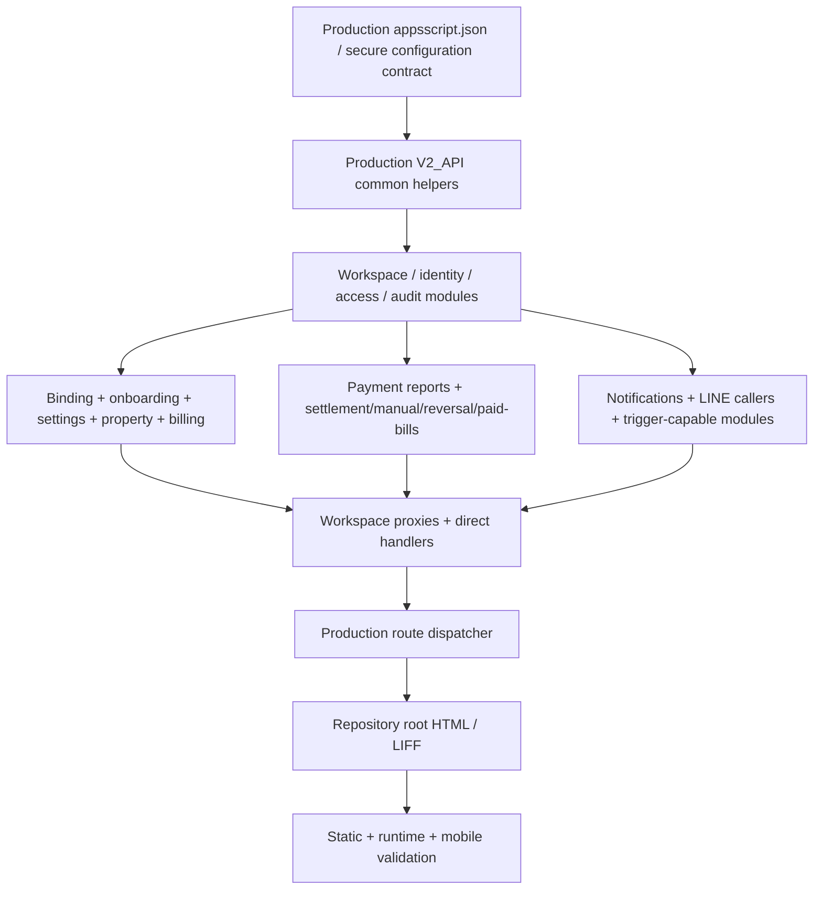

# V2 Candidate Gap Report

- 分析日期：2026-07-19（Asia/Taipei）
- Production canonical：`apps-script/`
- Candidate：`_handoff/cmwebs-codex-handoff-2026-07-18/candidate-overlay/`
- Frontend reference：repository root
- Phase：Canonical Consolidation Phase 1 — read-only comparison

本報告比較 Production raw baseline 與 Candidate overlay 的實際 bytes、函式、route、Sheet reference、runtime dependency、LINE、trigger 與 HTML dependency。比較時把 `.js`／`.gs` 視為同一 Apps Script 類型，並將 Production `程式碼.js` 對應 Candidate `Code.gs`；沒有用檔名、大小或修改時間推定新版。

本輪未修改 `apps-script/`、`_handoff/`、任何 HTML 或 Production runtime，也沒有建立 merge。

## Executive findings

1. Production 有 30 個 `.js`；Candidate 有 21 個 `.gs`。Candidate-only Apps Script module 為 0，Production-only module 為 9。
2. 21 個 shared modules 中，20 個逐位元相同；`V2_WORKSPACE_DASHBOARD_NATIVE` 只差檔尾空白，去除 EOF whitespace 後相同。Candidate 沒有 Production module 的功能性修改。
3. Production `程式碼.js` 與 Candidate `Code.gs` 逐位元相同：都是 68 routes、68 unique、0 duplicate。因此 Candidate 新增／修改／移除 route 均為 0。
4. Candidate 不是可執行 backend：缺 6 個 first-level handlers、6 個 Workspace proxy targets、7 個 common helpers，以及共 9 個 Production modules。
5. Candidate-only Sheet reference 為 0，Candidate 新增 trigger 為 0，Candidate 新增 LINE push path 為 0。
6. Candidate public 有 26 HTML；19 個與 repository 逐位元相同、5 個只差 EOF、2 個有行為衝突。Candidate-only HTML 為 0，並缺 repository 的 18 頁。
7. Candidate public 仍連到自身不存在的 7 頁，不能 wholesale 取代 repository root。
8. 結論：Candidate 是 Production backend 與 repository frontend 的不完整內容子集，不是待 cherry-pick 的新版功能集合。

## Comparison method

- SHA-256／逐位元比較 shared files。
- 去除檔尾 whitespace 後再次比較非逐位元相同檔。
- 擷取 top-level function 與 top-level variable ownership。
- 從 `Code` 擷取 `v2Action === '<route>'`，比較 route set。
- 以 `docs/22-BASELINE-DIFF-REPORT.md` 的 68 組 route → handler mapping 驗證 handler ownership。
- 擷取 candidate function calls，與 Production top-level function owner 交叉比對 runtime dependency。
- 擷取 `V2_*` Sheet-name literal、`ScriptApp` trigger APIs、LINE／notification calls。
- 逐檔比較 candidate public 與 repository root，並解析內部 `.html` link target。
- Candidate 只作 read-only input；沒有用 Production 補寫 Candidate 或反向修改來源。

## A. 新增 Module

### Candidate-only Apps Script modules

無。

```text
Candidate Apps Script modules: 21
Candidate-only modules: 0
```

### Production-only modules missing from Candidate

| Production module | Candidate status | Runtime impact |
|---|---|---|
| `V2_API.js` | Missing | 缺 JSONP／bridge／webhook／LINE／sheet/access-log helpers、tenant home/bills 與 legacy/formal handlers。 |
| `V2_TENANT_BINDING_PHONE.js` | Missing | `tenant_binding_status`、`tenant_bind_submit` 缺 first-level handler。 |
| `V2_TENANT_LEASE_ONBOARDING.js` | Missing | `landlord_tenant_create_init`、`landlord_tenant_create` 缺 first-level handler。 |
| `V2_PAYMENT_SETTLEMENT.js` | Missing | Settlement Workspace proxy 缺正式 target。 |
| `V2_MANUAL_SETTLEMENT.js` | Missing | Manual settlement proxy 缺正式 target。 |
| `V2_PAYMENT_REVERSAL.js` | Missing | Reopen proxy 缺正式 target。 |
| `V2_PAID_BILL_MANAGEMENT.js` | Missing | Paid-bills proxy 缺正式 target。 |
| `V2_LEGACY_BILL_IMPORT.js` | Missing | 缺 migration／reconciliation／preview utility；不直接影響 68 routes。 |
| `TESTS.js` | Missing | 缺 Production diagnosis；不直接影響 runtime routes。 |

Candidate 缺少的 Production modules 不可解讀為「應刪除 Production 功能」。Phase 1 不從 Candidate 反向裁切 Production baseline。

## B. 修改 Module

### Apps Script content comparison

| Candidate module | Production mapping | Result |
|---|---|---|
| `Code.gs` | `程式碼.js` | `SAME` — byte-identical。 |
| `V2_ANNOUNCEMENT_MANAGEMENT.gs` | `.js` | `SAME`。 |
| `V2_AUTO_PAYMENT_REMINDER.gs` | `.js` | `SAME`。 |
| `V2_BILLING_MANAGEMENT.gs` | `.js` | `SAME`。 |
| `V2_BILL_NOTIFICATIONS.gs` | `.js` | `SAME`。 |
| `V2_CONTRACT_REQUESTS.gs` | `.js` | `SAME`。 |
| `V2_LANDLORD_MANAGEMENT.gs` | `.js` | `SAME`。 |
| `V2_LANDLORD_ONBOARDING.gs` | `.js` | `SAME`。 |
| `V2_PROPERTY_ROOM_MANAGEMENT.gs` | `.js` | `SAME`。 |
| `V2_SETTINGS_INTEGRATION.gs` | `.js` | `SAME`。 |
| `V2_SYSTEM_SETTINGS.gs` | `.js` | `SAME`。 |
| `V2_TEAM_MANAGEMENT.gs` | `.js` | `SAME`。 |
| `V2_TENANT_CHECKIN_MANAGEMENT.gs` | `.js` | `SAME`。 |
| `V2_TENANT_MESSAGES.gs` | `.js` | `SAME`。 |
| `V2_TENANT_PAYMENT_REPORTS.gs` | `.js` | `SAME`。 |
| `V2_WORKSPACES.gs` | `.js` | `SAME`。 |
| `V2_WORKSPACE_CREATION.gs` | `.js` | `SAME`。 |
| `V2_WORKSPACE_DASHBOARD_NATIVE.gs` | `.js` | `EOF_ONLY` — raw bytes 不同，去除檔尾 whitespace 後相同；函式與功能無差異。 |
| `V2_WORKSPACE_LANDLORD_ACCESS.gs` | `.js` | `SAME`。 |
| `V2_WORKSPACE_NOTIFICATIONS.gs` | `.js` | `SAME`。 |
| `V2_WORKSPACE_OPERATION_AUDIT.gs` | `.js` | `SAME`。 |

統計：

```text
Byte-identical: 20
EOF-only: 1
Functional modification: 0
Candidate-only module: 0
```

## C. Production 已存在但 Candidate 修改

### Backend

沒有 Production backend module 被 Candidate 功能性修改。

- `V2_WORKSPACE_DASHBOARD_NATIVE` 的唯一差異為檔尾 whitespace，不能視為功能變更或 candidate newer。
- `.js` 與 `.gs` 副檔名差異不代表內容修改。
- 把 Candidate 同名檔直接放入 Production global scope 不是「修改」而是 duplicate declaration 風險。

### Frontend behavior conflicts

| HTML | Repository behavior | Candidate behavior | Classification | Decision |
|---|---|---|---|---|
| `tenant-home.html` | 未綁定時導向 `tenant-bind.html`；格式化帳單月份。 | 缺少該導向並直接顯示原始月份。 | `CONFLICT` | 不可直接搬；既有規格推薦 repository 行為，仍需人工批准／回歸。 |
| `tenant-bills.html` | Full-height modal、overscroll containment、open 時 scroll reset。 | Bottom sheet。 | `CONFLICT` | 不可直接搬；repository 行為只是 provisional，須 LINE WebView 實機驗收。 |

其餘 candidate HTML：19 個 byte-identical、5 個只差 EOF、0 個 candidate-only。

## D. Candidate 新增 Route

### Route difference

| Metric | Production | Candidate | Difference |
|---|---:|---:|---:|
| Route declarations | 68 | 68 | 0 |
| Unique routes | 68 | 68 | 0 |
| Duplicate routes | 0 | 0 | 0 |
| Candidate-added route | — | — | 0 |
| Candidate-modified route mapping | — | — | 0 |
| Candidate-removed route | — | — | 0 |
| First-level handler coverage | 68/68 | 62/68 | Candidate 缺 6 |

Candidate `Code.gs` 與 Production `程式碼.js` byte-identical；差異是 Candidate 沒有 route 所需 module，而不是 route table 不同。

Candidate 缺少的 first-level handlers：

```text
tenant_binding_status -> getTenantBindingStatusByLineUid_
tenant_bind_submit -> bindTenantByLineUid_
landlord_tenant_create_init -> getLandlordTenantCreateInitByLineUid_
landlord_tenant_create -> createLandlordTenantLeaseByLineUid_
tenant_home -> getTenantHomeByLineUid
tenant_bills -> getTenantBillsByLineUid
```

Candidate 缺少的 proxy targets：

```text
getLandlordLineLogsByLineUid
landlordSendTenantMessageByLineUid_
settleLandlordPaymentReportByLineUid_
manualSettleLandlordBillByLineUid_
reopenLandlordBillByLineUid_
getLandlordPaidBillsInitByLineUid_
```

## E. Candidate 新增 Sheet

Candidate-only Sheet-name literal：0。

```text
Production V2 sheet-name literals: 38
Candidate V2 sheet-name literals: 32
Candidate-only: 0
Production-only: 6
```

Production-only Sheet/storage references：

```text
V2_landlord_arrears_view
V2_liff_access_logs
V2_manual_settlement_logs
V2_payment_reversal_logs
V2_sync_logs
V2_tenant_binding_logs
```

以上差異來自 Candidate 缺少 `V2_API`、binding、manual settlement、reversal 等 modules。Shared modules byte-identical，因此沒有 Candidate header/schema modification 可 merge。String-literal inventory 不是 Google Sheets live schema snapshot；本輪沒有讀寫正式 Sheet，未把 literal presence 推定為 live Sheet 已存在。

## F. Candidate 新增 Trigger

Candidate-added trigger：0。

| Trigger-capable area | Production | Candidate | Difference |
|---|---|---|---|
| Automatic payment reminder | `V2_AUTO_PAYMENT_REMINDER.js` | Shared module byte-identical；handler=`runV2AutomaticPaymentReminders`，hourly installer path 相同 | 0 |
| V1 paid sync | `V2_API.js` 含 `installV1PaidSyncTrigger`／`syncV1PaidBillsToV2` | Missing `V2_API` | Candidate 缺 Production capability；不是新增 |

不得把 Candidate auto-reminder module與 Production 同名 module並存，否則 installer／handler duplicate，且可能造成錯誤 trigger 操作。任何 trigger install/delete 都不屬於本輪分析範圍。

## LINE Push and notification difference

Candidate 新增 LINE push path：0。Shared caller modules與 Production byte-identical，但 Candidate 缺少 `V2_API` 提供的 `pushLineTextMessage_`、`cmwebsLogLineMessage_`、webhook 與部分 log helper。

Candidate 內的 LINE／notification callers包括：

- `V2_ANNOUNCEMENT_MANAGEMENT`
- `V2_AUTO_PAYMENT_REMINDER`
- `V2_BILLING_MANAGEMENT`
- `V2_BILL_NOTIFICATIONS`
- `V2_CONTRACT_REQUESTS`
- `V2_LANDLORD_MANAGEMENT`
- `V2_TENANT_CHECKIN_MANAGEMENT`
- `V2_TENANT_MESSAGES`
- `V2_TENANT_PAYMENT_REPORTS`
- `V2_WORKSPACE_NOTIFICATIONS`

部分 module 直接使用 `UrlFetchApp.fetch/fetchAll`，部分委派 `workspaceNotifyTeam_`／`pushLineTextMessage_`。內容與 Production 相同，不可 cherry-pick 成「新通知功能」；Candidate 單獨執行反而可能因 helper missing 失敗。

## HTML dependency

| Metric | Repository root | Candidate public | Gap |
|---|---:|---:|---:|
| HTML files | 44 | 26 | Candidate 缺 18 |
| Byte-identical shared pages | — | 19 | No merge needed |
| EOF-only shared pages | — | 5 | No functional merge needed |
| Behavior conflicts | — | 2 | Human decision required |
| Candidate-only HTML | — | 0 | 0 |
| Candidate links to missing candidate pages | — | 7 | Wholesale deployment blocker |

Candidate 內部連結但自身缺少的頁面：

```text
landlord-activity.html
landlord-line-logs.html
landlord-messages.html
landlord-paid-bills.html
landlord-payment-reports.html
landlord-settings.html
landlord-workspaces.html
```

## G. 依賴順序

Candidate 不是可獨立排序成完整 runtime 的集合。任何後續 consolidation review 必須從 Production ownership出發：



Dependency-order rules：

1. `V2_API` common helper owner必須先存在；Candidate 自身不具備。
2. Workspace access／audit先於任何 domain write handler。
3. Payment proxies只有在四個 Production payment target modules存在時才完整。
4. LINE callers只有在 push/log/webhook helper與 notification center owner存在時才完整。
5. Trigger-capable module在 trigger inventory、idempotency、人工批准前不得執行 installer。
6. `Code` route coverage只能在完整 module set組裝後驗證。
7. HTML promotion在 route／handler／helper完整後進行；Candidate public不能先 wholesale replace。

## H. Merge Risk

| Risk | Severity | Evidence | Control |
|---|---|---|---|
| Global duplicate declarations | Critical | Candidate 692 functions與60個 top-level variables全部已存在 Production | 不得並存；每個 canonical basename只能一份。 |
| Incomplete runtime | Critical | 9 modules、6 direct handlers、6 proxy targets、7 common helpers missing | 不得把 Candidate作 backend baseline。 |
| `Code` overwrite/no-op confusion | Critical | `Code.gs` 與 `程式碼.js` 相同，但檔名不同 | 不得同時保留；rename屬獨立 normalization，不是 feature merge。 |
| Credential propagation | Critical | `Code` byte-identical，會重複既有 credential-like constants | 未完成 security gate前不得 commit/push/deploy。 |
| Payment proxy partial merge | Critical | Candidate access proxy存在，但正式 settlement targets缺失 | Payment owner與proxy必須用 Production完整 bundle驗證。 |
| LINE helper missing | High | 多個 Candidate caller存在，`V2_API` 不存在 | 不得單搬通知 caller；先保留 Production helper owner。 |
| Trigger duplication | High | Auto-reminder installer與handler已在 Production | 不得並存或執行 installer；先對帳 trigger inventory。 |
| Sheet subset誤判 | High | Candidate少6個 Production Sheet/storage references | 不得以 Candidate反向刪 Sheet、header或sync log。 |
| Frontend wholesale replacement | Critical | Candidate缺18頁，並有7個斷鏈 target | Repository root維持 canonical。 |
| HTML behavior conflict | High | `tenant-home`／`tenant-bills` 有行為差異 | 人工決策與實機回歸，不直接 cherry-pick。 |

## I. Merge Priority

| Priority | Action | Rationale |
|---|---|---|
| P0 | 封鎖 Candidate backend整包 merge與任何同名 module並存 | Candidate沒有新增功能，且會造成 duplicate/incomplete runtime。 |
| P0 | 保留 Production-only 9 modules與完整 helper/proxy targets | 是現行 68-route runtime、migration或diagnosis dependency。 |
| P0 | `Code`／credentials只按 security + normalization獨立計畫處理 | Candidate `Code`不是新版本，直接搬只增加風險。 |
| P1 | 完成兩個 HTML conflict人工決策與 mobile regression | 是唯一實際 frontend behavior delta。 |
| P1 | 驗證7個 Candidate缺頁連結與完整44頁 navigation | 防止 candidate public wholesale造成404。 |
| P1 | 驗證 Workspace、LINE、payment、billing與trigger isolation | Candidate dependency subset不能代表 flow完整。 |
| P2 | 保存 shared hash provenance，將 EOF-only差異標為 no-op | 降低無意義 merge noise。 |
| P2 | 決定 Candidate overlay長期 archive／retention policy | Candidate不是 canonical source。 |

## J. 哪些可以直接 Cherry Pick

### Apps Script

無。

- 20 個 byte-identical modules是 no-op，cherry-pick不會增加功能。
- `V2_WORKSPACE_DASHBOARD_NATIVE` 只差 EOF，cherry-pick只產生無意義 formatting noise。
- Candidate-only module、route、Sheet、trigger、LINE path均為0。

### HTML

無需要直接 cherry-pick的 Candidate HTML。

- 24 個 SAME／EOF-only頁保留 repository即可。
- 2 個 conflict頁需要人工行為決策，不能直接 cherry-pick。

## K. 哪些必須整包搬移

Candidate 沒有任何獨有功能需要「從 Candidate 整包搬移」。如果未來做 Production normalization／module ownership移轉，下列必須視為完整 dependency bundle，來源仍應是 Production baseline：

| Bundle | Required members | Reason |
|---|---|---|
| Runtime core | Dispatcher + `V2_API` + manifest + all first-level handlers | Route table與response/webhook helpers不可分離。 |
| Tenant identity | Workspace/access + binding + lease onboarding + audit | Phone、LINE UID、租約、view與permission是一個一致性單位。 |
| Payment | Tenant reports + Workspace proxies + settlement + manual + reversal + paid-bills + audit | 不能只搬proxy或單一狀態更新函式。 |
| LINE/notification | `V2_API` push/log/webhook + Workspace notifications + event callers | Preference-off、notification center、push與failure log必須一起驗證。 |
| Auto reminder | Settings integration + reminder module + notifications + trigger inventory | 排程、動態days、final+1與防重不可拆開。 |
| Frontend | Repository 44頁 + route compatibility +兩個conflict decisions | Candidate 26頁不是完整deployable frontend。 |

上述是未來 merge boundary，不是本輪授權搬移。

## L. 哪些不能搬

| Candidate content | Decision | Reason |
|---|---|---|
| Candidate Apps Script整個目錄 | Cannot move | 不完整且與 Production大量duplicate。 |
| `Code.gs` 單檔 | Cannot move | 與 Production byte-identical；單搬不補runtime dependency，並可能形成第二份dispatcher。 |
| 任何 shared `.gs` 與對應 `.js` 並存 | Cannot move | Apps Script global scope會重複宣告。 |
| `V2_WORKSPACE_LANDLORD_ACCESS.gs` 單獨 | Cannot move | Payment／LINE proxy target依賴Production-only modules。 |
| `V2_AUTO_PAYMENT_REMINDER.gs` 作為新功能 | Cannot move | Production已存在相同行為；trigger installer有重複操作風險。 |
| Candidate public整個目錄 | Cannot move | 缺18頁、7個link targets，會造成frontend regression。 |
| Candidate `tenant-home.html` | Cannot move directly | 缺repository binding redirect與月份格式化。 |
| Candidate `tenant-bills.html` | Cannot move directly | UX行為衝突，需mobile實機決策。 |
| Candidate Sheet/trigger推定 | Cannot migrate | 沒有Candidate新增項；string／code presence不能取代live Schema/trigger inventory。 |

## Phase 1 conclusion

Candidate overlay沒有可辨識的新增 backend feature。Phase 1的正確結論不是開始搬 Candidate，而是：

1. 維持 `apps-script/` Production baseline的完整性。
2. 把 Candidate shared modules記錄為hash-equivalent provenance。
3. 封鎖 Candidate backend與public wholesale merge。
4. 將真正需要人工處理的範圍收斂到HTML conflict、Production normalization、security gate與legacy/runtime ownership。

## 本文件建立聲明

本輪只建立本報告；沒有修改任何Production／Candidate程式、HTML、Sheet、trigger、LINE設定、deployment或route，也沒有commit、push、deploy或clasp操作。
