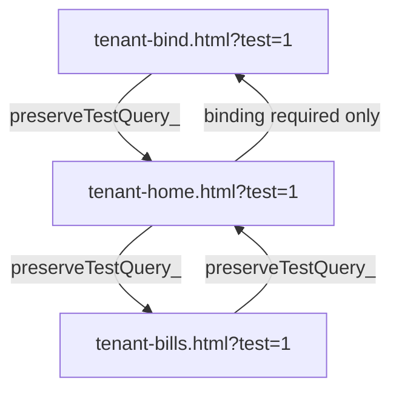
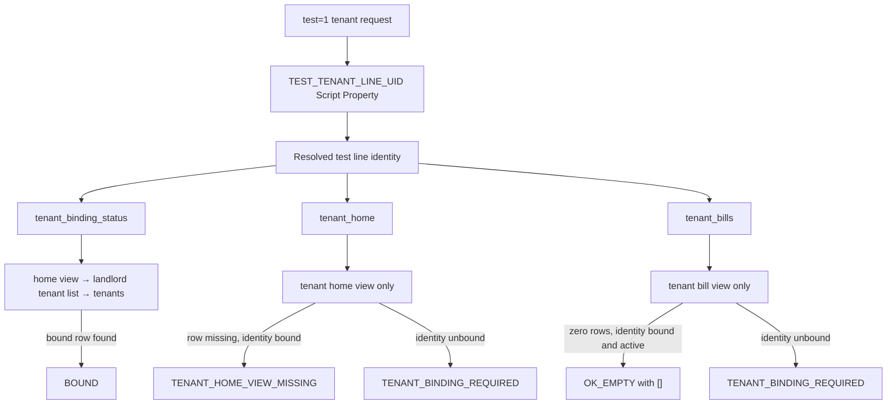

# CMWebs V2 Tenant Test Identity Loop and Bills Failure Incident

- Investigation date: 2026-07-20 (Asia/Taipei)
- Severity: P0 — Tenant Home cannot be reached in the reported `test=1` flow
- Method: repository source analysis, local mocks and the human-provided output of the approved read-only runtime diagnosis
- Runtime status: not deployed; no Google Sheets read/write; no repair or migration executed
- Post-fix device status: `NOT TESTED`
- Online status: still running the pre-fix frontend and pre-fix Apps Script deployment because no commit, push, `clasp push` or deployment has occurred

## 1. Incident reproduction

Human-observed sequence:

1. Open `tenant-bind.html?test=1`.
2. The page reports that test tenant `T000020` is already bound.
3. Press **進入房客首頁**.
4. Tenant Home redirects to Tenant Bind again.
5. Repeating the action creates a Bind → Home → Bind loop.
6. Opening `tenant-bills.html?test=1` directly displays **帳單資料讀取失敗**.
7. `tenant-contract.html?test=1` can read contract alias `C000019` and room `603`.
8. `tenant-message.html?test=1` displays **聯絡資料讀取失敗**.

The tester did not provide device model, OS/app version, exact API error code, timestamp or screenshot filename. Those evidence fields remain pending in `docs/39-TENANT-REAL-DEVICE-RESULTS.md`.

## 2. Executive root cause

Two source-level defects explain the observed behaviors. The read-only runtime diagnosis has now confirmed the exact derived-row gap described below; no repair has yet been executed.

### 2.1 Bind/Home loop

`test=1` itself is parsed correctly, the three affected pages contain the same page-local test identity, and the four core navigation directions already appended `test=1`. The loop is therefore **not explained by query-string loss or different frontend test UIDs**.

The confirmed code-path mismatch is:

- `tenant_binding_status` calls `tenantBindingResolveByLineUid_()`, which searches `V2_tenant_home_view`, then `V2_landlord_tenant_list_view`, then `V2_tenants`.
- `tenant_home` calls `getTenantHomeByLineUid()`, which searches only `V2_tenant_home_view`.
- An identity can consequently be reported as bound from `V2_tenants` or `V2_landlord_tenant_list_view` while Tenant Home cannot find a matching `line_user_id` row in `V2_tenant_home_view`.
- The pre-fix Home frontend treated `TENANT_NOT_FOUND` as an unbound identity and redirected to Bind. Bind could again resolve the same identity as already bound, producing the loop.
- `bindTenantByLineUid_()` returns immediately for an already-bound identity. It does not synchronize view rows in that branch. This explains why repeatedly entering Bind cannot repair the mismatch; no repair was run in this investigation.

The human observation proves that the deployed read paths disagree. Static source analysis cannot prove whether the matching `V2_tenant_home_view` row is missing, stale, uses another UID field, or belongs to an inconsistent tenant/workspace/contract relation.

### 2.2 Bills failure

The primary `tenant_bills` handler reads only `V2_tenant_bill_view`. Before this fix, zero matching rows returned:

```text
success=false, code=BILLS_NOT_FOUND, data=[]
```

`tenant-bills.html` correctly sends that response through `unwrapData()`, which throws on `success !== true`; the generic error card then shows **帳單資料讀取失敗**. Therefore a valid, bound tenant with no bill rows was incorrectly presented as an API failure instead of the existing empty state.

The exact deployed response code was not captured. A missing sheet or another runtime exception could also produce `SYSTEM_ERROR`; the manual sheet checklist in section 8 is still required.

### 2.3 Why Contract works while Home, Bills and Message fail

- Contract identity resolution searches `V2_tenant_home_view`, `V2_landlord_tenant_list_view` and `V2_tenants`, then reads `V2_contracts`. It can therefore resolve the test tenant and contract even when the Home view is missing or stale.
- Home requires a matching `V2_tenant_home_view` row.
- Bills requires matching `V2_tenant_bill_view` rows; the pre-fix handler treats zero matches as failure.
- Message calls `getTenantHomeByLineUid()` first, then needs `V2_landlord_tenant_list_view`. A Home-view failure prevents Message from reaching its link/message read.

This combination is consistent with the reported runtime observations and is now corroborated by the read-only diagnostic summarized in section 2.4.

### 2.4 Confirmed Phase 41 data gap

The approved read-only diagnosis confirmed one canonical tenant, one active contract, one same-Workspace property/room relation and one issued unpaid master bill. It also confirmed zero matching rows in all three derived Views:

- `V2_tenant_home_view`
- `V2_tenant_bill_view`
- `V2_landlord_tenant_list_view`

The shared root cause is that the old synchronization paths were not self-healing:

- the already-bound branch returned before running any View synchronization;
- binding synchronization updated matching View rows but did not insert missing rows;
- billing inserted/updated the bill View but updated Home and landlord-list summaries only when those rows already existed;
- onboarding upserts matched only `tenant_id`, without a Workspace-aware canonical key;
- contract and room status updates did not consistently invoke a common derived-View synchronizer.

This permits valid master data created by a legacy/imported path, an earlier version, or an interrupted multi-sheet operation to remain permanently absent from all three Views.

## 3. Frontend identity and query audit

| Check | `tenant-bind.html` | `tenant-home.html` | `tenant-bills.html` | Result |
|---|---|---|---|---|
| Parse query | `URLSearchParams(location.search)` | Same | Same | Correct |
| Test predicate | `get('test') === '1'` | Same | Same | Correct |
| Test UID source | Page-local legacy constant | Page-local legacy constant | Page-local legacy constant | Same literal remains unchanged; test API identity is now overridden server-side from Script Properties |
| `TEST_TENANT_LINE_UID` Script Property | Sent as `test=1`, resolved by backend | Same | Same | `tenant_*` test requests use the required property with no hardcoded backend fallback |
| LIFF behavior in test mode | Returns before `liff.init()` | Same | Same | LIFF profile cannot overwrite the test identity in this branch |
| API identity field | `line_user_id` | `line_user_id` | `line_user_id` | Consistent |
| API receives `test=1` | Yes after pending frontend publication | Yes | Yes | Formal mode sends no test flag |
| JSONP callback | Unique timestamp/random callback | Same pattern | Same pattern | No static collision found |
| JSONP cleanup | Removes script, timer and callback | Same | Same | Correct on callback/timeout |

`resolveTenantRequestLineUserId_()` now applies only when the request explicitly has `test=1` and the action begins with `tenant_`. It reads `TEST_TENANT_LINE_UID` with `getRequiredScriptProperty_()` and never falls back to the browser-supplied UID when the property is missing. Formal requests retain their original `line_user_id`; landlord routes are outside this override.

The three pages still contain their legacy page-local test UID because changing every tenant page is outside this incident scope. For the pending Bind/Home/Bills API calls, that value is no longer authoritative in test mode. A complete removal must be a separately reviewed all-tenant frontend migration.

The repository validator currently scans Apps Script files for hardcoded LINE UIDs but not HTML files. Its `Hardcoded LINE UID: 0` output does not contradict the page-local constants above. No test UID was changed or reproduced in this report.

## 4. Navigation contract and identity flow

The same small helper is now present in the three affected standalone pages:

```javascript
preserveTestQuery_(targetUrl)
```

Contract:

- If the current page is in `test=1`, set exactly one `test=1` on the target.
- If the current page is formal mode, do not add `test=1`.
- Preserve target query parameters such as `v` and `bill_id`.
- Use the URL API so `?` and `&` cannot be duplicated.
- Never place a UID in the URL.

Applied core flow:



Pre-fix backend divergence and the post-fix classification are:



## 5. Route and handler audit

| Route | Dispatcher | Handler | Identity argument | Read source | Finding |
|---|---|---|---|---|---|
| `tenant_binding_status` | Exists | `getTenantBindingStatusByLineUid_` | `line_user_id` | Home view, landlord tenant list, tenants | Can report bound when Home view lacks a matching row |
| `tenant_bind_submit` | Exists | `bindTenantByLineUid_` | `line_user_id`, phone | Tenants, users, contracts, views | Already-bound branch returns without view synchronization; no write route was executed |
| `tenant_home` | Exists | `getTenantHomeByLineUid` | `line_user_id` | Tenant Home view | Now distinguishes unbound identity from bound-but-unsynchronized view |
| `tenant_bills` | Exists | `getTenantBillsByLineUid` | `line_user_id` | Tenant Bill view | Now returns a successful empty array only for a resolved, bound, active tenant |

All four routes keep the same handler argument and dispatcher field name, `line_user_id`. Before dispatch, explicit `test=1` tenant requests now replace that value with required Script Property `TEST_TENANT_LINE_UID`. No route or handler hardcodes a UID, and no LIFF profile can overwrite the server-resolved value. Formal requests do not enter this branch. Route names and handler interfaces were not changed.

Workspace isolation remains based on an exact tenant LINE identity match. The empty-bill response is not returned to an unknown or unbound identity: the handler first confirms that binding status resolves to a bound and active tenant.

## 6. Bills frontend and response-contract audit

| Item | Result |
|---|---|
| Primary action | `tenant_bills` — correct and present |
| Secondary action | `tenant_payment_report_init` — failure is caught independently and does not cause the primary error card |
| Endpoint | Same constant as Tenant Home; unchanged |
| Callback name | Timestamp plus random suffix; scoped prefix; no static duplicate found |
| Script/callback cleanup | Executes after callback or timeout |
| Timeout | 30 seconds; unchanged |
| Cache busting | `_` timestamp is independent of `callback`; no breakage found |
| Response gate | `unwrapData()` accepts `success === true`; correct behavior |
| Accepted data shape | Direct array, or object containing `bills`/`items` |
| Empty rendering | Existing empty card works when primary data is successful `[]` |
| Month fields | Backend emits `bill_month`; frontend can normalize `bill_month` and compatible month keys |
| Numeric fields | Defensive `Number(value || 0)` conversions; no static month/number exception found |
| API `test` parameter | Sent only when the current page is in `test=1`; backend resolves the Script Property identity |

## 7. Modified and protected scope

### Modified

- `tenant-bind.html`: added `preserveTestQuery_()` and routed Home navigation through it.
- `tenant-home.html`: added `preserveTestQuery_()`; Home, Bills, Bind and other existing `goPage()` destinations retain `test=1` safely.
- `tenant-bills.html`: added `preserveTestQuery_()`; Home/navigation and payment-report query parameters are preserved.
- All three affected HTML files: JSONP sends `test=1` only in test mode so backend identity resolution can use Script Properties.
- `apps-script/程式碼.js`: resolves explicit `tenant_*` test requests through the centralized helper and returns a non-sensitive configuration error if the required property is absent.
- `apps-script/V2_API.js`: added Script Property identity resolver and non-repair binding-state classification; Home now distinguishes missing synchronized view from unbound identity; Bills returns `success=true`, `ok=true`, `data=[]` and `bills=[]` only for a bound, active identity.
- `apps-script/TESTS.js`: added `diagnoseTestTenantRuntimeData()`, a Property/Spreadsheet read-only diagnostic with no route, repair or write-handler calls.
- `apps-script/V2_TENANT_RUNTIME_DATA_REPAIR.js`: added the canonical master-data resolver, Workspace-aware derived-View synchronizer, `repairTestTenantRuntimeViews()` and read-only `verifyTestTenantRuntimeViews()`.
- `apps-script/V2_TENANT_BINDING_PHONE.js`: both new-binding and already-bound paths now invoke the shared synchronizer so missing View rows can be inserted.
- `apps-script/V2_TENANT_LEASE_ONBOARDING.js`: Home/list upserts now use Workspace-aware canonical keys and the completed create flow runs the shared synchronizer.
- `apps-script/V2_BILLING_MANAGEMENT.js`: bill-view upsert keys are Workspace-aware and every bill create/update runs the shared synchronizer.
- `apps-script/V2_PROPERTY_ROOM_MANAGEMENT.js`: an occupied room update resynchronizes the unique active tenant relation.
- `apps-script/V2_CONTRACT_REQUESTS.js`: completed contract updates resynchronize the affected tenant Views and restore the contract row if synchronization is rejected.
- `docs/39-TENANT-REAL-DEVICE-RESULTS.md`: recorded only the five reported TH/TB observations; no PASS was added.
- `docs/40-TENANT-TEST-IDENTITY-INCIDENT.md`: this incident report.

### Not modified or executed

- No route name, handler signature or response data shape was changed.
- `V2_TENANT_PAYMENT_REPORTS.js` and `V2_WORKSPACES.js` remain unchanged in Phase 41.
- API endpoint, formal LIFF ID, Web App URL and test UID were not changed.
- No Script Property was read, written or changed.
- This repository phase did not read or write Google Sheets; its only production evidence is the redacted diagnosis supplied by the human operator.
- No bind submit, repair, migration, create, payment, bill or LINE notification action was executed.
- No `clasp push`, `clasp deploy`, deployment, commit or push occurred.

## 8. Read-only data diagnosis procedure

Function:

```text
diagnoseTestTenantRuntimeData()
```

Location: `apps-script/TESTS.js`. It reads `TEST_TENANT_LINE_UID`, then reads only the eight sheets listed below. It does not call Tenant routes because those handlers can create access-log side effects.

The result includes the full test LINE UID because this diagnostic was explicitly requested for a private Apps Script execution log. Treat that log as sensitive: do not paste the full UID into Git, tickets, screenshots or this report.

Human execution after approved `clasp push`, but before Web App version deployment:

1. Confirm `TEST_TENANT_LINE_UID` exists in Script Properties without copying its value.
2. Open the Apps Script editor for the intended project and select `diagnoseTestTenantRuntimeData`.
3. Verify the selected function name exactly; do not select a repair, migration, create, bind, payment or notification function.
4. Run once and grant only the normal read authorization if prompted.
5. Open the execution log and save a redacted copy of identifiers/counts. Mask the full LINE UID.
6. Check `missing_required_rows`, `duplicate_or_conflict_rows`, `consistency`, per-sheet counts and selected row summaries.
7. Stop without changing data. Any reconciliation requires separate authorization.

Static source guard: the diagnostic contains no `setValue`, `setValues`, `appendRow`, insert/delete row, sheet creation, format mutation, LINE push, bill creation, contract mutation or binding mutation call.

### 8.1 Required human, read-only Google Sheets checks

The first human read-only verification is complete and confirmed the three missing Views. Before repair, run `diagnoseTestTenantRuntimeDataDetailed()` or `planTestTenantRuntimeDataRepair()` once more and stop if any master ID, duplicate count or Workspace relation differs from the confirmed baseline. Do not run an unrelated repair or migration.

For tenant alias `T000020`, compare the same masked identity and IDs across:

| Sheet | Required fields/conditions |
|---|---|
| `V2_tenants` | `tenant_id`, `tenant_user_id`/`user_id`, `workspace_id`, `current_contract_id`, `tenant_line_user_id`, `line_user_id`, binding status, account status |
| `V2_contracts` | Same tenant/user/workspace/contract relation, `tenant_line_user_id`, contract/account status and active date range |
| `V2_tenant_home_view` | Exactly one matching tenant/workspace row; `line_user_id` and `tenant_line_user_id`; account status; current contract and summary fields |
| `V2_tenant_bill_view` | Matching tenant/workspace/contract IDs; `line_user_id`/`tenant_line_user_id`; `bill_id`; `bill_month`/legacy `billing_month`; payment/bill status |
| `V2_bills` | Whether the tenant legitimately has zero bills or view rows failed to materialize; tenant/workspace/contract relation |
| `V2_landlord_tenant_list_view` | Whether binding status is resolving from this view while Home view is stale/missing |

Record only masked identity evidence. The missing Views may be reconciled only through the separately reviewed `repairTestTenantRuntimeViews()` flow; do not use the UI loop, bind submit, direct cell editing or a generic migration as a repair mechanism.

## 9. Static test results

| Check | Result |
|---|---|
| Modified HTML inline JavaScript syntax | PASS for Bind, Home and Bills |
| `preserveTestQuery_()` in `test=1` | PASS: exactly one `test=1`; target parameters retained |
| `preserveTestQuery_()` in formal mode | PASS: no `test=1` added |
| JSONP test flag | PASS locally: added only when `TEST_MODE` is true |
| Script Property resolver | PASS locally: tenant test action uses `TEST_TENANT_LINE_UID`; formal and landlord actions retain supplied identity |
| Static Bind → Home → Bills → Home URL contract | PASS locally; device/runtime retest pending |
| Mock bound identity with missing Home view | PASS: `TENANT_HOME_VIEW_MISSING`; no Bind redirect code |
| Mock unbound identity with missing Home view | PASS: `TENANT_BINDING_REQUIRED` |
| Mock bound, active identity with zero bills | PASS: `success=true`, `ok=true`, `data=[]`, `bills=[]` |
| Mock unbound identity with zero bills | PASS: `TENANT_BINDING_REQUIRED` |
| `diagnoseTestTenantRuntimeData()` syntax/write guard | PASS: all required sheets present in source; prohibited write/repair/LINE calls absent |
| Mock diagnostic missing Home/Bill view and zero bills | PASS: required missing row, counts and linked identifiers reported |
| Missing Home/Bill/List View planning | PASS: exactly one insert per canonical key |
| Repeated View synchronization | PASS: second plan is unchanged with zero operations |
| Duplicate View key | PASS: conflict is fail-closed before writes |
| Master bill/contract status protection | PASS: synchronization planning does not mutate either master status |
| `npm run validate` | PASS: 31 Apps Script files, 44 HTML files, 68 unique routes, handler coverage 68/68, blocking credentials 0, HTML links missing 0 |
| Post-fix real-device result | **NOT TESTED** |

Static PASS results do not change TH-03, TH-04, TH-05, TB-03 or TB-04 to PASS. Those cases require a fresh human device run after a separately authorized deployment and any required data reconciliation.

## 10. Regression risk

- `getTenantHomeByLineUid()` now performs an additional binding-status lookup only when the Home view has no matching row. Normal successful Home reads are unchanged. The existing binding-status access logger may record that lookup when this repository code is later deployed.
- `getTenantBillsByLineUid()` performs the extra binding-status lookup only when the filtered bill list is empty. Existing non-empty bill responses are unchanged, and the same normal access-logging consideration applies.
- An unavailable binding lookup now yields `TENANT_IDENTITY_LOOKUP_FAILED`, not a misleading Bind redirect or empty success.
- A bound but inactive tenant still receives `ACCOUNT_NOT_ACTIVE`.
- Other tenant pages still use their existing navigation and page-local test identity patterns. A future centralized runtime test-identity migration must cover all tenant routes together.
- The changed Apps Script code is repository-only and has no production effect unless separately reviewed and deployed.
- The repair function performs a full conflict preflight before writing. It never deletes duplicate rows automatically; duplicate or cross-Workspace keys require human resolution.

## 11. Publication and deployment requirements

### 11.1 Frontend

Yes, frontend publication requires an approved commit and push to the repository branch/path used by GitHub Pages. Until that happens, public Tenant HTML continues to run the old navigation and API-request code. No GitHub Pages publication occurred in this investigation.

### 11.2 Apps Script backend

Yes, backend activation requires an approved `clasp push`, a new immutable Apps Script version and an update of the existing Web App deployment to that version. The existing Web App URL must remain unchanged. Confirm `TEST_TENANT_LINE_UID` is configured before activating the new version. No `clasp` or deployment command occurred here.

### 11.3 Recommended order

1. Complete human diff/security review and create the approved repository commit.
2. Confirm the local `.clasp.json` points to the intended Apps Script project without committing that file.
3. Confirm `TEST_TENANT_LINE_UID` exists in Script Properties; do not copy its value into Git or terminal output.
4. Run `npm run validate` and `git diff --check` again on the exact commit.
5. Run approved `clasp push` for the canonical `apps-script/` source.
6. Before changing the Web App deployment, run `diagnoseTestTenantRuntimeDataDetailed()` and `verifyTestTenantRuntimeViews()` from the Apps Script editor and review redacted results.
7. Stop if any canonical ID, duplicate count or Workspace relation differs from the confirmed baseline.
8. With separate data-write approval, run `repairTestTenantRuntimeViews()` once, then run the read-only verifier and require all checks to pass.
9. Run the repair a second time and require an idempotent `unchanged` result with zero conflicts.
10. Create a new Apps Script version and update the existing Web App deployment ID to that version, preserving its URL.
11. Smoke-test backend read routes with the approved test identity; perform no payment, binding, contract or notification write.
12. Push the reviewed frontend commit to the GitHub Pages source and wait for Pages publication.
13. Execute the four-page retest below, then update `docs/39-TENANT-REAL-DEVICE-RESULTS.md` from observed evidence only.

## 12. Retest URLs and acceptance

After manual data verification and a separately authorized deployment, retest in this order:

1. `tenant-bind.html?test=1`
2. `tenant-home.html?test=1`
3. `tenant-bills.html?test=1`
4. Return to `tenant-home.html?test=1`

Required observations:

- Every internal URL retains exactly one `test=1` and contains no UID.
- A bound tenant is not redirected to Bind because a Home view is missing; a clear synchronization error is shown instead.
- An actually unbound tenant still reaches Bind once.
- A bound, active tenant with zero bills sees the empty state, not the failure card.
- A tenant with bills sees only the correct workspace/tenant bills and month order.
- Formal `tenant-home.html` and `tenant-bills.html` never acquire `test=1` automatically.

Do not submit binding, payment, contract, repair or notification actions during retest.

## 13. Rollback

No deployment exists to roll back in this phase. Before commit, rollback consists only of reverting the reviewed changes in:

- `tenant-bind.html`
- `tenant-home.html`
- `tenant-bills.html`
- `apps-script/程式碼.js`
- `apps-script/V2_API.js`
- `apps-script/TESTS.js`
- `apps-script/V2_TENANT_RUNTIME_DATA_REPAIR.js`
- `apps-script/V2_TENANT_BINDING_PHONE.js`
- `apps-script/V2_TENANT_LEASE_ONBOARDING.js`
- `apps-script/V2_BILLING_MANAGEMENT.js`
- `apps-script/V2_PROPERTY_ROOM_MANAGEMENT.js`
- `apps-script/V2_CONTRACT_REQUESTS.js`
- `docs/39-TENANT-REAL-DEVICE-RESULTS.md`
- `docs/40-TENANT-TEST-IDENTITY-INCIDENT.md`
- `docs/41-TENANT-RUNTIME-VIEW-REPAIR.md`

After any rollback, rerun inline JavaScript syntax checks and `npm run validate`. Do not restore data or run repair from this document.
