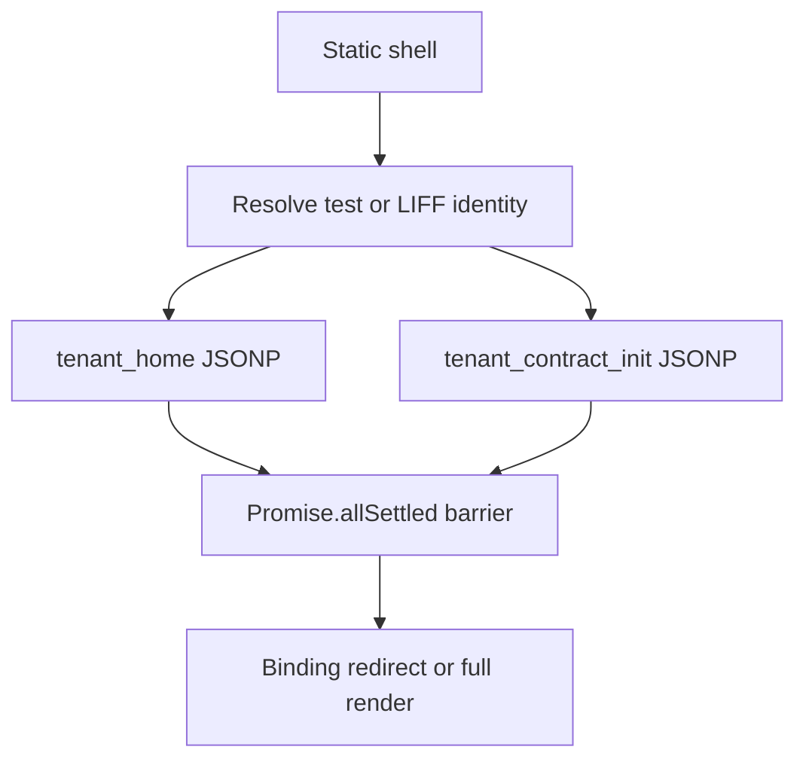
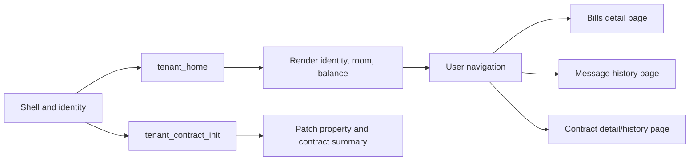

# Phase 73 — Critical Path Lazy Loading Design Audit

## Status and scope

- Status: **DESIGN ONLY — NOT IMPLEMENTED**
- Target: `tenant-home.html` initial loading path
- Constraints observed: no production code, API schema, route, deployment, or data changes
- Evidence source: current repository source plus the Phase 68–72 performance and payload audits
- Timing and payload figures in this document are static estimates or earlier audit observations, not new production measurements.

## 1. Current `tenant_home` initial loading sequence

The current browser flow is:

1. Load the static page shell and call `loadPage()`.
2. Resolve tenant identity:
   - `test=1` uses the test identity flow.
   - Normal mode initializes LIFF, redirects to login when necessary, and calls `liff.getProfile()`.
3. Start two JSONP requests in parallel:
   - `tenant_home`
   - `tenant_contract_init`
4. Wait for **both** requests through `Promise.allSettled()`.
5. Treat `tenant_home` failure as a page-level failure or binding redirect.
6. Treat `tenant_contract_init` failure as optional, but only after its promise settles.
7. Call `renderPage(home, contractData)` once and remove the full-page loading state.

Both JSONP calls have a 30-second timeout. A script load error currently logs a warning but does not immediately reject, so an optional contract request can hold the first useful render until the timeout expires.

## 2. Current data ownership

| Initial UI requirement | Current source | Criticality | Observation |
|---|---|---:|---|
| Tenant identity | `tenant_home` | Blocking | Required to validate the tenant and decide whether to redirect to binding. |
| Room identity | `tenant_home` | Blocking | `room_list` supports the primary tenant context. |
| Property | `tenant_contract_init` | Desired critical-path field | Not present in the current `tenant_home` payload and not currently rendered as an independent Home field. It cannot be fabricated without an API change. |
| Contract status | `tenant_contract_init` | Important, non-identity | Home derives the displayed state primarily from contract dates. It must remain “loading” until this request resolves. |
| Balance summary | `tenant_home` | Blocking | Latest bill summary, unpaid count, and unpaid total are already available. |
| Full contract/request history | `tenant_contract_init` | Non-critical | Home scans the request list only to find the latest relevant request. |
| Bill details | Separate `tenant_bills` page | Deferred | Not requested by Home today. |
| Message history | Separate `tenant_message_init` page | Deferred | Not requested by Home today. |

Phase 72 estimated the compact `tenant_home` response at about 414 bytes for a representative fixture. Payload size is therefore not the primary Home bottleneck; the main issue is the render barrier around the heavier contract initialization request.

## 3. Request classification

### Blocking requests

- Test/LIFF identity resolution: the page cannot safely select tenant data before this completes.
- `tenant_home`: determines binding state and provides tenant, room, and balance summary data.

### Non-critical request currently acting as blocking

- `tenant_contract_init`: its failure is already treated as optional, but `Promise.allSettled()` still delays the first render until it succeeds, fails, or times out.

### Requests and data that can be deferred

- Full contract request history.
- Full bills and bill details; keep these on `tenant-bills.html`.
- Message history; keep it on `tenant-message.html`.
- Other optional contract metadata not used above the fold.

No new Home requests should be introduced for bills or messages. Lazy loading here means retaining those boundaries and removing optional data from the Home first-render barrier.

## 4. Proposed lazy-loading architecture

### Initial critical path

The first useful render should require only:

1. Tenant identity and binding result.
2. Room context, plus property only when safely available from an existing response.
3. A contract-status placeholder or resolved summary.
4. Balance summary.

Because the current `tenant_home` schema does not include property or contract status, strict API compatibility requires a staged render:

- Render tenant identity, room, and balance immediately after `tenant_home` succeeds.
- Reserve a stable skeleton region for property and contract status.
- Patch that region after the existing `tenant_contract_init` response arrives.
- Never show “查無合約” merely because the optional request is still pending.

### Lazy content

- Full contract history: do not block first render. Under the current API it arrives with `tenant_contract_init`; the UI should consume only the summary after primary render. A truly separate history fetch would require a future API projection or route and is outside this phase.
- Bills detail: load only after navigation to `tenant-bills.html`.
- Message history: load only after navigation to `tenant-message.html`.

### Scheduling options

| Option | Behavior | Benefit | Cost | Recommendation |
|---|---|---|---|---|
| Parallel, independent await | Start both requests together, but render as soon as `tenant_home` resolves. | Removes the current render barrier while preserving fastest contract arrival. | Does not reduce concurrent backend load. | **Recommended first migration step.** |
| Post-primary defer | Start `tenant_contract_init` only after Home primary data renders. | Reduces contention on the critical request and makes prioritization explicit. | Contract card arrives later. | Evaluate after measuring the first migration on real devices. |

## 5. Proposed frontend state model

The future implementation should separate page and section state:

1. `BOOTSTRAP`: static shell and identity initialization.
2. `PRIMARY_LOADING`: `tenant_home` pending.
3. `PRIMARY_READY`: tenant, room, and balance rendered.
4. `CONTRACT_LOADING`: reserved contract/property skeleton remains visible.
5. `CONTRACT_READY`: patch property, status, and latest relevant request.
6. `CONTRACT_ERROR`: show a section-level retry/error message without replacing the primary page.

Required safeguards for a future implementation:

- Split the monolithic render into primary and contract-section render functions.
- Give each refresh a generation token so an older optional response cannot overwrite newer state.
- Keep binding redirects controlled only by the canonical `tenant_home` identity result.
- Preserve `test=1` on every existing internal navigation and API call.
- Reserve section height to limit layout shift.
- Reject JSONP load errors promptly while retaining timeout cleanup and callback cleanup.
- Disable or coalesce repeated refreshes while a generation is active.

## 6. API compatibility

The recommended first step requires **no route or response-schema change**:

- Keep `tenant_home` unchanged.
- Keep `tenant_contract_init` unchanged.
- Change only the future frontend scheduling and incremental rendering behavior.
- Keep bills and messages on their current page-level routes.

The property requirement remains a known limitation: it is unavailable at the exact moment the primary Home payload arrives. With the schema frozen, property must be patched from the contract response or omitted from the first paint. Adding it to `tenant_home`, creating a summary route, or adding a projection flag would be a separate API change with documentation and regression-test obligations.

## 7. Risk and migration assessment

| Area | Risk | Complexity | Control |
|---|---|---:|---|
| Frontend request scheduling | Medium | Medium | Independent promise handling and section states. |
| Stale response after refresh | High if unmanaged | Medium | Per-load generation token; ignore stale callbacks. |
| False “no contract” state | High | Low | Explicit `loading`, `ready`, and `error` states. |
| Property unavailable on primary response | Medium | Low under current schema | Patch later; do not fabricate or mislabel. |
| Binding/login behavior | High | Low | Preserve existing identity and redirect gates unchanged. |
| API compatibility | Low for recommended design | Low | Existing routes and schemas remain unchanged. |
| Layout shift | Low | Low | Contract/property skeleton with reserved height. |
| True contract-history endpoint split | Medium–High | High | Defer to a separate phase with route, docs, and tests. |

## 8. Validation plan for a future implementation

### Static checks

- `npm run validate` passes.
- No route, endpoint, LIFF ID, response schema, or navigation target changes.
- JSONP callbacks and script elements are cleaned for success, error, timeout, and stale generations.

### Functional checks

- Bound tenant sees identity, room, and balance before contract initialization completes.
- Unbound tenant still redirects before protected content is shown.
- Slow or failed contract initialization does not block or erase primary Home content.
- Contract pending state never displays as “查無合約”.
- Contract summary patches exactly once for the active generation.
- Bills detail and message history are not fetched on Home.
- Refresh and background/foreground transitions do not duplicate or reorder renders.
- `test=1` and normal LIFF mode retain their existing identity boundaries.

### Performance evidence

Record separately for iPhone LINE WebView, Android LINE WebView, Safari, and Chrome:

- Identity initialization duration.
- `tenant_home` request duration.
- Time to primary content.
- `tenant_contract_init` duration.
- Time to contract-section patch.
- Count of Home requests per load and refresh.
- Section-level timeout/error behavior.

The acceptance target should be based on measured production-like results, not on the static payload estimates in this audit.

## 9. Rollback

The recommended future change is frontend-only. Rollback consists of restoring the prior `tenant-home.html` request barrier and single-render behavior, then republishing the previous GitHub Pages revision. Apps Script source, Web App deployment, routes, and Sheet data would remain untouched.

## Decision summary

- The current first paint is unnecessarily blocked by `tenant_contract_init` even though its failure is treated as optional.
- The safest Phase 74 candidate is a frontend-only staged render: start both existing calls, await `tenant_home` for primary content, then patch the contract/property section independently.
- Bills detail and message history are already separate-page concerns and must remain outside the Home critical path.
- Full contract history should not block Home. A true payload split is optional future work and would require an explicitly approved API change.
- This Phase 73 audit made no production code, API, frontend, data, or deployment changes.
