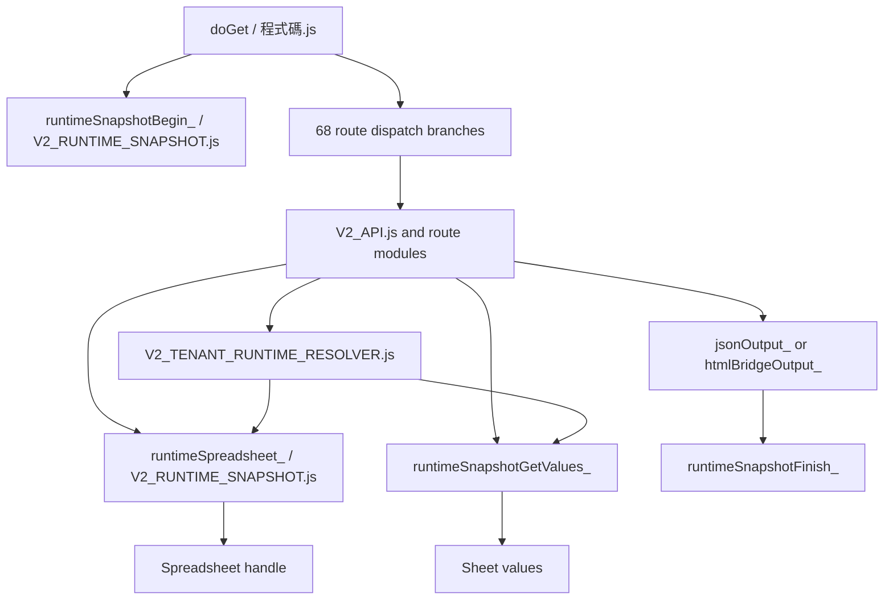

# Phase 77 — Release Boundary and Manifest

日期：2026-07-21

狀態：**DESIGN COMPLETE — RELEASE TREE NOT YET BUILT / NOT APPROVED FOR DEPLOYMENT**

## 1. Purpose and evidence boundary

本文件解決 Phase 76 發現的 release boundary 問題，將 Phase 40–76 的變更分成：

1. production required；
2. development/admin only；
3. documentation only。

本階段不修改 production code、API contract、frontend behavior、Sheet、manifest、clasp
binding 或 deployment。Manifest 定義的是下一個隔離 release tree 應有的內容，不代表
目前 `apps-script/` 或 `release/phase54/` 已可直接 push。

Repository 與 deployment 的可信基準：

- Phase 60 已將 `release/phase54/apps-script/` 的 30-file source payload 部署為 Web App
  version 74。
- Phase 57/60 記錄 version 73 為主要 rollback target。
- Phase 69–74 的效能與 frontend lazy-loading 修改目前仍只存在本機工作樹。
- Phase 66/67 沒有可由 repository 識別的 source artifact；任何外部 deployment 狀態
  必須在實際 release 前重新確認。

## 2. Phase 40–76 classification

| Phase range | Production required | Development/admin only | Documentation only |
|---|---|---|---|
| 40–41 | Tenant test-query preservation、Home/Bills response fixes、JSONP compatibility、canonical read resolver | Data diagnosis、dry-run repair、View repair/sync tools、test payload functions | Incident、Bills、repair and View reports |
| 42–45 | None beyond already-selected tenant runtime | `diagnoseTenantDataConsistency()` and deployment verification helpers | Diagnosis runbook/result and deployment analysis |
| 46 | Deterministic landlord-link selection design feeding Phase 51 | No data deletion or Sheet repair | Remediation plan |
| 47–50 | No source release by review/ownership phases | Local clasp/ownership evidence only | Backend and ownership review documents |
| 51–53 | Deterministic tenant/landlord resolver、shared Home/Message identity chain、recipient isolation、`test=1` Message forwarding | Repair module、read-only fixtures and manual validation | Resolver separation and minimal implementation records |
| 54–60 | Sanitized 30-file Apps Script v74 runtime release | Local ignored `.clasp.json`; checksum/call-graph tooling | Release, dependency, preflight, rollback, binding and deployment records |
| 61–67 | No new route/API requirement; deployed v74 remains baseline | Read-only validation module/manual function and smoke-test tools | Smoke-test and project/deployment diagnosis; some phases have no repository file |
| 68 | None | None | Runtime performance audit |
| 69 | `tenant_home` profile omitting unused bill-master read | Local performance fixtures | Optimization record |
| 69B | None | None | Sheet-read inventory |
| 70 | Request-level snapshot layer for four approved read routes | Debug counters/Logger instrumentation used for verification | Snapshot design and verification record |
| 71A | None | Local verification procedure | Verification report |
| 71B | Request-local Spreadsheet handle reuse across runtime modules | Counter instrumentation | Handle-reuse report |
| 72–73 | None | None | Payload and critical-path design audits |
| 74 | `tenant-home.html` staged primary/contract rendering | Ephemeral local render fixture only | Implementation record |
| 75–76 | None | Browser/performance execution plan | Verification and release preparation documents |

## 3. Production-required frontend files

The complete Phase 40–76 frontend release boundary is:

| File | Required behavior | Release note |
|---|---|---|
| `tenant-bind.html` | Preserve `test=1` across Bind → Home navigation | Earlier incident fix; review full diff |
| `tenant-home.html` | Preserve test identity/API query and Phase 74 primary/optional render separation | Includes mixed Phase 40 and Phase 74 changes |
| `tenant-bills.html` | Preserve test identity and accept canonical/legacy Bills payload wrappers | Earlier incident fix; no Phase 74 Home prefetch |
| `tenant-message.html` | Preserve `test=1` in Message API request | Required for shared test identity path |

These four files form one reviewed frontend commit because they jointly maintain the Bind → Home →
Bills/Message identity flow. Other repository HTML files remain byte-for-byte unchanged in this
release.

## 4. Minimum safe Apps Script deploy set

Apps Script `clasp push` replaces project source. The minimum safe backend payload is therefore the
complete route runtime, not only the changed performance files.

### Included files — exact push manifest

```text
appsscript.json
V2_ANNOUNCEMENT_MANAGEMENT.js
V2_API.js
V2_AUTO_PAYMENT_REMINDER.js
V2_BILLING_MANAGEMENT.js
V2_BILL_NOTIFICATIONS.js
V2_CONTRACT_REQUESTS.js
V2_LANDLORD_MANAGEMENT.js
V2_LANDLORD_ONBOARDING.js
V2_MANUAL_SETTLEMENT.js
V2_PAID_BILL_MANAGEMENT.js
V2_PAYMENT_REVERSAL.js
V2_PAYMENT_SETTLEMENT.js
V2_PROPERTY_ROOM_MANAGEMENT.js
V2_RUNTIME_SNAPSHOT.js
V2_SETTINGS_INTEGRATION.js
V2_SYSTEM_SETTINGS.js
V2_TEAM_MANAGEMENT.js
V2_TENANT_BINDING_PHONE.js
V2_TENANT_CHECKIN_MANAGEMENT.js
V2_TENANT_LEASE_ONBOARDING.js
V2_TENANT_MESSAGES.js
V2_TENANT_PAYMENT_REPORTS.js
V2_TENANT_RUNTIME_RESOLVER.js
V2_WORKSPACES.js
V2_WORKSPACE_CREATION.js
V2_WORKSPACE_DASHBOARD_NATIVE.js
V2_WORKSPACE_LANDLORD_ACCESS.js
V2_WORKSPACE_NOTIFICATIONS.js
V2_WORKSPACE_OPERATION_AUDIT.js
程式碼.js
```

Count:

- JavaScript modules: 30
- Apps Script manifest: 1
- Total clasp source files: **31**

This is the Phase 60 v74 manifest plus the mandatory new
`V2_RUNTIME_SNAPSHOT.js` module.

### Source provenance rule

The listed names alone are insufficient. File content must be built as follows:

1. Start from the exact sanitized source deployed as version 74 in
   `release/phase54/apps-script/`.
2. Add `V2_RUNTIME_SNAPSHOT.js` from the reviewed Phase 70/71 implementation.
3. Apply only the reviewed Phase 69–71 performance deltas to the sanitized v74 modules:
   - `tenant_home` read profile;
   - request snapshot begin/finish and snapshot-aware readers;
   - canonical resolver request-context reuse;
   - mechanical `runtimeSpreadsheet_()` substitutions.
4. Do not copy whole dirty canonical modules where that would reintroduce View-sync writers,
   repair entrypoints, diagnostics, or unrelated Phase 40–53 work that v74 intentionally excluded.
5. Keep `appsscript.json` semantically identical to v74.

This source-provenance rule is mandatory because the current canonical working files are not the
same sanitized files that produced version 74.

## 5. Explicit exclusions

### Excluded from clasp source

```text
TESTS.js
V2_TENANT_RUNTIME_DATA_REPAIR.js
V2_TENANT_RUNTIME_VALIDATION.js
V2_LEGACY_BILL_IMPORT.js
.clasp.json
.clasprc.json
credentials.json
credentials.local.json
OAuth/client-secret files
```

Also excluded at symbol/workflow level:

- `syncTenantRuntimeViewsForTenant_()`;
- `repairTestTenantRuntimeData()`;
- `repairTestTenantRuntimeViews()`;
- diagnosis, repair, rollback, preview, planning and fixture entrypoints not required by a route;
- View-sync calls added to billing, contract, property/room, binding and onboarding write paths;
- migration/import entrypoints;
- any Script Property value, token, UID or credential.

### Excluded from frontend publication

- Every HTML file except the four files in Section 3.
- Docs and release artifacts.
- Apps Script Web App URL or LIFF ID changes.

### Excluded release artifacts

- `release/phase54/` must not be pushed as-is; it lacks Phase 69–71 changes and the snapshot helper.
- `release/phase57/` remains immutable rollback evidence and is never a clasp source directory.
- `docs/` files are Git documentation, not Web App or GitHub Pages runtime payload.

## 6. Runtime dependency closure

### Global dependency graph



### Tenant read routes

```text
tenant_home
  → getTenantHomeByLineUid()
  → resolveCanonicalTenantRuntimeByLineUid_()
  → runtimeSpreadsheet_() / runtimeSnapshotGetValues_()
  → tenantRuntimeHomeData_()
  → jsonOutput_() → runtimeSnapshotFinish_()

tenant_bills
  → getTenantBillsByLineUid()
  → Bills identity/read projection
  → runtimeSpreadsheet_() / runtimeSnapshotGetValues_()
  → jsonOutput_() → runtimeSnapshotFinish_()

tenant_contract_init
  → getTenantContractInitByLineUid_()
  → contract request readers
  → runtimeSpreadsheet_() / runtimeSnapshotGetValues_()
  → jsonOutput_() → runtimeSnapshotFinish_()

tenant_message_init
  → getTenantMessageInitByLineUid()
  → resolveCanonicalTenantRuntimeByLineUid_()
  → deterministic landlord recipient isolation
  → runtimeSpreadsheet_() / runtimeSnapshotGetValues_()
  → jsonOutput_() → runtimeSnapshotFinish_()
```

### `runtimeSpreadsheet_()` availability result

Current canonical analysis finds:

- 30 production JavaScript names in the proposed payload.
- 28 production modules call `runtimeSpreadsheet_()`; `V2_RUNTIME_SNAPSHOT.js` defines it, and
  `程式碼.js` instead starts the request state through `runtimeSnapshotBegin_()`.
- The only direct `SpreadsheetApp.openById()` and
  `SpreadsheetApp.getActiveSpreadsheet()` calls remaining in canonical Apps Script are inside
  `V2_RUNTIME_SNAPSHOT.js`.
- The helper file is included in the same global Apps Script project source.

Result for the **designed 31-file manifest**: **DEPENDENCY COMPLETE**.

Result for existing `release/phase54`: **INCOMPLETE FOR PHASE 69–71** because it does not contain
`V2_RUNTIME_SNAPSHOT.js` or the converted callers.

## 7. TESTS/admin/repair/migration isolation result

### Current canonical source

Current canonical files are **not** directly isolatable by deleting the four excluded modules:

- Six calls to `syncTenantRuntimeViewsForTenant_()` remain in included-name modules.
- The calls occur in Billing, Contract Requests, Property/Room, Tenant Binding (two calls), and
  Tenant Lease Onboarding.
- The function itself is defined in the excluded repair module.

Therefore a `clasp push` from `apps-script/` would either:

1. include repair/write tooling, violating the boundary; or
2. omit the repair module and leave six undefined production write-path calls.

Both options are rejected.

### Designed isolated source

The version 74 sanitized files already removed all View-sync calls and had no executable dependency
on `TESTS.js`, repair, legacy import, or diagnostics. Building Phase 77 from that baseline and
applying only Phase 69–71 deltas preserves the isolation.

Required build assertions:

- excluded modules absent;
- zero `syncTenantRuntimeViewsForTenant_` references;
- zero calls to symbols whose only definition is in an excluded module;
- 68 unique routes and 68/68 handlers;
- snapshot helper present;
- direct Spreadsheet acquisition only inside snapshot helper;
- no installable trigger points to an excluded symbol;
- `.clasp.json` ignored and outside checksums.

Isolation result: **DESIGN PASS / BUILD NOT YET VERIFIED**.

## 8. Documentation-only release set

The Phase 40–76 repository documentation set includes:

- modified `docs/39-TENANT-REAL-DEVICE-RESULTS.md`;
- all incident, repair-plan, diagnosis, resolver, release, deployment and smoke-test records in
  `docs/40-*` through `docs/61C-*`;
- performance and lazy-loading records in `docs/68-*` through `docs/76-*`;
- this `docs/77-RELEASE-MANIFEST.md`.

Documents should be committed separately from runtime/frontend files when practical. They are not
part of clasp or GitHub Pages publication payloads.

## 9. Deployment order

No step in this section is authorized by Phase 77.

### Phase A — build and review

1. Re-confirm production is serving the expected existing deployment/version and that version 73
   remains available as rollback.
2. Create a new isolated release directory from the v74 sanitized source; do not mutate
   `release/phase54`.
3. Apply the narrow Phase 69–71 deltas and add `V2_RUNTIME_SNAPSHOT.js`.
4. Verify the exact 31-file manifest and generate new SHA-256 checksums/call graph.
5. Run syntax, dependency, forbidden-symbol, credential, UID, route, handler and trigger audits.
6. Review snapshot Logger policy before release.
7. Review the complete four-file frontend diff and record the published rollback commit.

### Phase B — backend source and deployment

1. With separate approval, bind only the new isolated directory to the verified production Apps
   Script project using an ignored `.clasp.json`.
2. Run `clasp status` and compare exactly 31 source files.
3. With explicit approval, perform one whole-project `clasp push` from the isolated directory.
4. Verify editor file inventory and execute only approved read-only validation.
5. Create one new immutable version.
6. Update the existing Web App deployment only; preserve deployment ID, URL, execute-as and access
   settings.
7. Smoke-test endpoint, tenant identity, Home, Contract, Bills and Message reads.

### Phase C — frontend

1. Publish the reviewed `tenant-bind.html`, `tenant-home.html`, `tenant-bills.html`, and
   `tenant-message.html` commit after backend smoke tests pass.
2. Verify Bind → Home → Bills → Home and Home → Message flows in normal and approved test modes.
3. Confirm Phase 74 primary render precedes optional contract completion.

### Phase D — performance verification

1. Execute the Phase 75 Chrome canonical-account, different-account and Incognito plan.
2. Record before/after build IDs, p50/p95, Sheet reads, snapshot hits and handle counters.
3. Do not claim improvement until measured results pass the documented gates.

## 10. Rollback boundary

### Backend atomic boundary

- Unit: complete 31-file Apps Script source plus one immutable Apps Script version.
- Primary rollback: repoint the same Web App deployment to verified version 73.
- Preserve deployment ID and Web App URL.
- If source restoration is also required, push the exact version 74 sanitized source only under a
  separate authorization and checksum verification.

### Frontend atomic boundary

- Unit: the reviewed four-file tenant frontend commit.
- Rollback: republish the immediately preceding GitHub Pages commit for all four files.
- Do not roll back unrelated HTML.

### Data boundary

- No Sheet schema/data migration belongs to this release.
- Do not use repair or View-sync as rollback.
- No LINE action, payment action, bill creation, or notification action is part of verification.

Backend and frontend rollback must remain independently executable because backend is deployed via
Apps Script while frontend is published through GitHub Pages.

## 11. Minimum safe deploy set summary

| Layer | Minimum safe set | Ready now? |
|---|---|---|
| Backend | Exact 31-file manifest from sanitized v74 + reviewed Phase 69–71 deltas | **NO — design complete, isolated tree not built** |
| Frontend | Four tenant HTML files in one reviewed commit | **NO — mixed-phase full diff and real-device retest pending** |
| Docs | Phase 39–77 records, separate Git-only unit | Ready for documentation review; not runtime |
| Rollback | Existing deployment version 73 plus prior frontend commit | Backend version recorded; frontend commit must be recorded before publication |

The minimum backend cannot be reduced to only `V2_RUNTIME_SNAPSHOT.js`, `V2_API.js`, resolver and
dispatcher because clasp source replacement would remove handlers for the other 68-route modules.

## 12. Optional cleanup after release

These are not release prerequisites unless a review promotes them to blockers:

1. Gate or remove `[V2_RUNTIME_SNAPSHOT]` Logger instrumentation after Phase 75 evidence is
   collected.
2. Move embedded `test*`/diagnostic entrypoints out of production modules into `TESTS.js` without
   changing runtime handlers.
3. Remove the definition-only `tenantRuntimeDiagnosticRow_()` candidate from the excluded repair
   module after a separate admin-tool review.
4. Archive the immutable Phase 54/v74 tree and mark it explicitly as rollback-only; create a new
   checksum manifest for the Phase 77 tree.
5. Reconcile repository `apps-script/` with the exact deployed sanitized source so future releases
   do not require mixed-source reconstruction.
6. Decide separately whether View synchronization is a production requirement; if approved, move
   it into a dedicated runtime module rather than the repair module and validate every write path.
7. Perform payload pagination/projection work only in a future API-versioned phase.

## 13. Release gates

- [ ] New isolated source contains exactly the 31 included files.
- [ ] SHA-256 manifest matches 31/31.
- [ ] `V2_RUNTIME_SNAPSHOT.js` is present and every runtime caller resolves.
- [ ] Zero reference to excluded repair/migration/test symbols.
- [ ] 68 routes unique; handler coverage 68/68.
- [ ] Duplicate top-level declarations: 0.
- [ ] Blocking credentials and hardcoded LINE UID: 0.
- [ ] `appsscript.json` unchanged semantically.
- [ ] `.clasp.json` ignored and untracked.
- [ ] Installable triggers rechecked against excluded symbols.
- [ ] Snapshot Logger retention explicitly approved or separately gated.
- [ ] Backend rollback version and frontend rollback commit recorded.
- [ ] Full frontend mixed-phase diff reviewed.
- [ ] No code, source, deployment or data change occurs without separate approval.

## 14. Final decision

- Release boundary: **DEFINED**.
- Runtime dependency graph: **COMPLETE FOR THE DESIGNED MANIFEST**.
- TEST/admin/repair/migration isolation: **DESIGN PASS; CURRENT CANONICAL ROOT FAILS DIRECT PUSH**.
- Minimum safe deploy set: **31 backend source files + 4 frontend files as separate atomic units**.
- Safe to push or deploy now: **NO**; the new isolated tree and its checksums still need to be built
  and reviewed.

Phase 77 creates only this design document. It does not modify production code, API contracts,
frontend behavior, Google Sheets, clasp configuration, Git history or deployment state.
