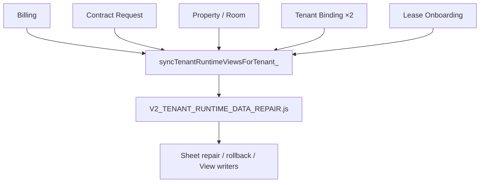
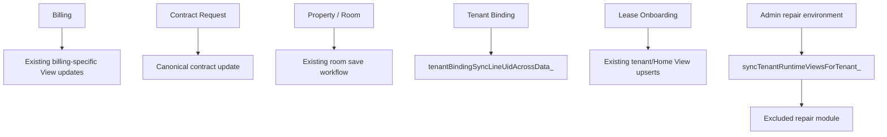

# Phase 79 — Release Dependency Cleanup

日期：2026-07-21

狀態：**IMPLEMENTED LOCALLY — NOT COMMITTED / NOT PUSHED / NOT DEPLOYED**

## 1. Objective

Phase 78 found six production-path calls to `syncTenantRuntimeViewsForTenant_()` while the only
definition remained in excluded `V2_TENANT_RUNTIME_DATA_REPAIR.js`. This phase classifies and
removes the orphan dependency without changing deployed API routes, response contracts, frontend
behavior or Sheet schema.

## 2. Classification rule

| Class | Meaning | Action |
|---|---|---|
| A | Required production behavior with no existing safe equivalent | Move the minimum implementation into a production-safe module |
| B | Repair/admin workflow only | Remove from production path; retain only in excluded tooling |
| C | Legacy/unapproved integration left in a production file | Remove and restore the deployed production boundary |

## 3. Reference inventory and classification

All six references were added after the sanitized source used for production version 74. None is
present in `release/phase54/apps-script/`, and none is part of the deployed v74 API contract.

| # | File / workflow | Existing production behavior | Class | Decision |
|---:|---|---|---|---|
| 1 | `V2_BILLING_MANAGEMENT.js` — bill View refresh | `billingSyncBillViews_()` already upserts `V2_tenant_bill_view` and updates Home/landlord summaries | C | Remove redundant generic repair sync |
| 2 | `V2_CONTRACT_REQUESTS.js` — approved renewal/termination | v74 updates the canonical contract and returns the formal contract result; generic View repair was an unapproved additional write boundary | C | Remove generic sync and its rollback coupling |
| 3 | `V2_PROPERTY_ROOM_MANAGEMENT.js` — existing room update | v74 saves room state under existing Workspace/role validation; scanning a tenant and writing three Views was an unapproved side effect | C | Remove generic sync block |
| 4 | `V2_TENANT_BINDING_PHONE.js` — already-bound branch | Binding already resolves the bound tenant and clears failure state | C | Remove repair sync and diagnostic response field |
| 5 | `V2_TENANT_BINDING_PHONE.js` — new binding branch | `tenantBindingSyncLineUidAcrossData_()` already synchronizes the LINE UID across the relevant tenant/View sources | C | Remove redundant generic sync |
| 6 | `V2_TENANT_LEASE_ONBOARDING.js` — tenant/lease creation | The workflow already creates/upserts landlord tenant and tenant Home View rows before completing | C | Remove redundant generic sync |

Classification result:

- A — production required: **0**
- B — repair/admin only: **0 production references**
- C — legacy/unapproved leftover: **6**

Because no reference is Class A, no new production View-sync runtime module is required.

## 4. Removed references

The following production references were removed:

```text
V2_BILLING_MANAGEMENT.js          1
V2_CONTRACT_REQUESTS.js           1
V2_PROPERTY_ROOM_MANAGEMENT.js    1
V2_TENANT_BINDING_PHONE.js        2
V2_TENANT_LEASE_ONBOARDING.js     1
                                  ─
Total                             6
```

Associated, never-deployed `view_sync` diagnostic fields and
`CONTRACT_VIEW_SYNC_FAILED` coupling were removed with those references. This restores the response
shape and write behavior of the sanitized v74 production source; it does not remove a field or
error code from the deployed API.

The Phase 69–71 `runtimeSpreadsheet_()` substitutions and snapshot-aware readers in these modules
remain unchanged.

## 5. Retained references

`syncTenantRuntimeViewsForTenant_()` remains only inside the excluded repair module:

1. Its function definition.
2. The explicit admin entrypoint `repairTestTenantRuntimeViews()`.

This is intentional. The repair module can still be reviewed or executed in an admin-only source
environment, but it is absent from the minimum production deploy tree.

No production route, handler, scheduled workflow or retained runtime module calls it after this
cleanup.

## 6. Dependency graph before



Problem:

- Include the repair module → production payload contains admin/repair writers.
- Exclude the repair module → six production call sites fail with `ReferenceError` when reached.

## 7. Dependency graph after



Production paths no longer cross into the repair/admin boundary.

## 8. Modified files

- `apps-script/V2_BILLING_MANAGEMENT.js`
- `apps-script/V2_CONTRACT_REQUESTS.js`
- `apps-script/V2_PROPERTY_ROOM_MANAGEMENT.js`
- `apps-script/V2_TENANT_BINDING_PHONE.js`
- `apps-script/V2_TENANT_LEASE_ONBOARDING.js`
- `docs/79-RELEASE-DEPENDENCY-CLEANUP.md`

No API dispatcher, route name, frontend HTML, Apps Script manifest, Sheet schema or deployment
configuration was modified.

## 9. Isolation result

Static excluded-symbol analysis used the four Phase 78 exclusions:

```text
TESTS.js
V2_TENANT_RUNTIME_DATA_REPAIR.js
V2_TENANT_RUNTIME_VALIDATION.js
V2_LEGACY_BILL_IMPORT.js
```

After cleanup:

- production references to `syncTenantRuntimeViewsForTenant_()`: **0**;
- calls from included modules to functions defined only in excluded modules: **0**;
- retained repair-module references: definition + explicit repair entrypoint only;
- direct Spreadsheet acquisition remains centralized in `V2_RUNTIME_SNAPSHOT.js`;
- production snapshot dependency remains intact.

The Phase 78 orphan blocker is resolved at source-dependency level.

## 10. API and behavior boundary

This cleanup intentionally restores the deployed v74 boundary:

- no route names changed;
- no handler signatures changed;
- no formal deployed response fields were removed;
- no frontend parsing or navigation changed;
- no Sheet schema or canonical ID rule changed;
- no repair or migration was moved into production.

The current working tree had local-only `view_sync` response fields tied to an excluded repair
implementation. Those fields were never deployed and are not part of the canonical public API.

## 11. Risk assessment

| Risk | Severity | Control |
|---|---:|---|
| Derived Views expected to update through the removed generic writer | P1 | Billing, Binding and Lease keep their existing specialized View updates; Contract/Room behavior returns to v74 and requires normal regression tests |
| Phase 71B helper changes accidentally removed | P0 | Static diff confirms `runtimeSpreadsheet_()` substitutions remain |
| Repair function becomes inaccessible in admin source | P2 | Function remains in `V2_TENANT_RUNTIME_DATA_REPAIR.js`; only production callers were removed |
| API response regression | P1 | Response returns to the already deployed v74 shape; route and handler validation remain unchanged |
| Future desire for automatic View synchronization | P2 | Must be a separately approved production module with write authorization, Workspace isolation and transaction/rollback tests |

## 12. Rollback

This phase is not deployed. Local rollback consists of restoring the six call blocks and associated
local-only `view_sync` fields. That rollback would also restore the orphan dependency and therefore
must not be used as a production release source unless the sync implementation is first separated
into an approved production module.

No Sheet or deployment rollback is required.

## 13. Validation checklist

- [x] Located all eight repository references: one definition, one admin repair call, six production calls.
- [x] Classified all six production calls.
- [x] Removed six Class C dependencies.
- [x] Production references after cleanup: zero.
- [x] Excluded-symbol findings from included modules: zero.
- [x] JavaScript syntax check for all five modified modules: PASS.
- [x] `npm run validate`: PASS — 68 unique routes, 68/68 handler coverage.
- [x] `git diff --check`: PASS.

## 14. Final decision

- Removed production references: **6**.
- Retained production references: **0**.
- Retained admin-only references: **2** inside the excluded repair module.
- New production View-sync module: **not required**.
- Phase 78 orphan blocker: **RESOLVED LOCALLY**.
- Safe to deploy: **not authorized in Phase 79**.

No commit, Git push, clasp push or deployment was performed.
