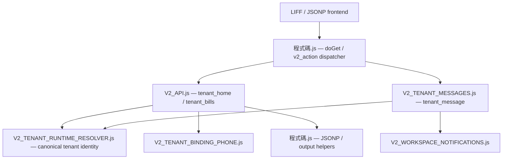

# Phase 55 Runtime Call Graph

Date: 2026-07-20  
Source: `release/phase54/apps-script/`  
Scope: 29 JavaScript runtime modules plus `appsscript.json`

## Method

The graph was built from top-level function ownership and identifier call sites
after masking comments and string literals. An edge `A → B` means code in module
`A` calls at least one top-level function owned by module `B`. Apps Script global
namespace behavior, route-dispatch references, and manifest-trigger entrypoints
were included in the audit. Dynamic calls constructed only at runtime cannot be
proven by static analysis and remain a deployment smoke-test concern.

## Tenant runtime path

The resolver path is read-only. It does not call `TESTS.js`,
`V2_TENANT_RUNTIME_DATA_REPAIR.js`, a diagnostic entrypoint, a repair function,
or a View-sync writer.

## Dispatcher fan-out

`程式碼.js` owns the 68-route dispatcher and directly references handlers in:

- `V2_ANNOUNCEMENT_MANAGEMENT.js`
- `V2_API.js`
- `V2_BILLING_MANAGEMENT.js`
- `V2_BILL_NOTIFICATIONS.js`
- `V2_CONTRACT_REQUESTS.js`
- `V2_LANDLORD_ONBOARDING.js`
- `V2_PROPERTY_ROOM_MANAGEMENT.js`
- `V2_SYSTEM_SETTINGS.js`
- `V2_TEAM_MANAGEMENT.js`
- `V2_TENANT_BINDING_PHONE.js`
- `V2_TENANT_CHECKIN_MANAGEMENT.js`
- `V2_TENANT_LEASE_ONBOARDING.js`
- `V2_TENANT_MESSAGES.js`
- `V2_TENANT_PAYMENT_REPORTS.js`
- `V2_WORKSPACES.js`
- `V2_WORKSPACE_CREATION.js`
- `V2_WORKSPACE_DASHBOARD_NATIVE.js`
- `V2_WORKSPACE_LANDLORD_ACCESS.js`
- `V2_WORKSPACE_NOTIFICATIONS.js`
- `V2_WORKSPACE_OPERATION_AUDIT.js`

## Complete module adjacency list

| Caller module | Called module(s) |
|---|---|
| `程式碼.js` | `V2_ANNOUNCEMENT_MANAGEMENT.js`, `V2_API.js`, `V2_BILLING_MANAGEMENT.js`, `V2_BILL_NOTIFICATIONS.js`, `V2_CONTRACT_REQUESTS.js`, `V2_LANDLORD_ONBOARDING.js`, `V2_PROPERTY_ROOM_MANAGEMENT.js`, `V2_SYSTEM_SETTINGS.js`, `V2_TEAM_MANAGEMENT.js`, `V2_TENANT_BINDING_PHONE.js`, `V2_TENANT_CHECKIN_MANAGEMENT.js`, `V2_TENANT_LEASE_ONBOARDING.js`, `V2_TENANT_MESSAGES.js`, `V2_TENANT_PAYMENT_REPORTS.js`, `V2_WORKSPACES.js`, `V2_WORKSPACE_CREATION.js`, `V2_WORKSPACE_DASHBOARD_NATIVE.js`, `V2_WORKSPACE_LANDLORD_ACCESS.js`, `V2_WORKSPACE_NOTIFICATIONS.js`, `V2_WORKSPACE_OPERATION_AUDIT.js` |
| `V2_ANNOUNCEMENT_MANAGEMENT.js` | `V2_WORKSPACES.js`, `V2_WORKSPACE_LANDLORD_ACCESS.js`, `V2_WORKSPACE_NOTIFICATIONS.js`, `V2_WORKSPACE_OPERATION_AUDIT.js` |
| `V2_API.js` | `V2_TENANT_BINDING_PHONE.js`, `V2_TENANT_RUNTIME_RESOLVER.js`, `程式碼.js` |
| `V2_AUTO_PAYMENT_REMINDER.js` | `V2_API.js`, `V2_SETTINGS_INTEGRATION.js`, `V2_WORKSPACE_NOTIFICATIONS.js` |
| `V2_BILLING_MANAGEMENT.js` | `V2_SETTINGS_INTEGRATION.js`, `V2_WORKSPACES.js`, `V2_WORKSPACE_LANDLORD_ACCESS.js`, `V2_WORKSPACE_NOTIFICATIONS.js`, `V2_WORKSPACE_OPERATION_AUDIT.js` |
| `V2_BILL_NOTIFICATIONS.js` | `V2_WORKSPACES.js`, `V2_WORKSPACE_LANDLORD_ACCESS.js`, `V2_WORKSPACE_OPERATION_AUDIT.js` |
| `V2_CONTRACT_REQUESTS.js` | `V2_API.js`, `V2_WORKSPACE_NOTIFICATIONS.js` |
| `V2_LANDLORD_MANAGEMENT.js` | `V2_API.js`, `V2_PAYMENT_SETTLEMENT.js` |
| `V2_LANDLORD_ONBOARDING.js` | `V2_API.js`, `V2_WORKSPACES.js` |
| `V2_MANUAL_SETTLEMENT.js` | `V2_API.js` |
| `V2_PAID_BILL_MANAGEMENT.js` | `V2_API.js` |
| `V2_PAYMENT_REVERSAL.js` | `V2_API.js` |
| `V2_PAYMENT_SETTLEMENT.js` | `V2_API.js`, `V2_MANUAL_SETTLEMENT.js` |
| `V2_PROPERTY_ROOM_MANAGEMENT.js` | `V2_SETTINGS_INTEGRATION.js`, `V2_WORKSPACES.js`, `V2_WORKSPACE_LANDLORD_ACCESS.js`, `V2_WORKSPACE_OPERATION_AUDIT.js` |
| `V2_SETTINGS_INTEGRATION.js` | none |
| `V2_SYSTEM_SETTINGS.js` | `V2_ANNOUNCEMENT_MANAGEMENT.js`, `V2_AUTO_PAYMENT_REMINDER.js`, `V2_WORKSPACES.js`, `V2_WORKSPACE_LANDLORD_ACCESS.js` |
| `V2_TEAM_MANAGEMENT.js` | `V2_WORKSPACES.js` |
| `V2_TENANT_BINDING_PHONE.js` | `V2_API.js` |
| `V2_TENANT_CHECKIN_MANAGEMENT.js` | `V2_WORKSPACES.js`, `V2_WORKSPACE_LANDLORD_ACCESS.js`, `V2_WORKSPACE_NOTIFICATIONS.js`, `V2_WORKSPACE_OPERATION_AUDIT.js` |
| `V2_TENANT_LEASE_ONBOARDING.js` | `V2_WORKSPACES.js`, `V2_WORKSPACE_LANDLORD_ACCESS.js`, `V2_WORKSPACE_OPERATION_AUDIT.js` |
| `V2_TENANT_MESSAGES.js` | `V2_API.js`, `V2_TENANT_RUNTIME_RESOLVER.js`, `V2_WORKSPACE_NOTIFICATIONS.js` |
| `V2_TENANT_PAYMENT_REPORTS.js` | `V2_API.js`, `V2_WORKSPACE_NOTIFICATIONS.js` |
| `V2_TENANT_RUNTIME_RESOLVER.js` | none |
| `V2_WORKSPACES.js` | `V2_API.js` |
| `V2_WORKSPACE_CREATION.js` | `V2_WORKSPACES.js` |
| `V2_WORKSPACE_DASHBOARD_NATIVE.js` | `V2_WORKSPACES.js`, `V2_WORKSPACE_LANDLORD_ACCESS.js` |
| `V2_WORKSPACE_LANDLORD_ACCESS.js` | `V2_API.js`, `V2_CONTRACT_REQUESTS.js`, `V2_LANDLORD_MANAGEMENT.js`, `V2_MANUAL_SETTLEMENT.js`, `V2_PAID_BILL_MANAGEMENT.js`, `V2_PAYMENT_REVERSAL.js`, `V2_PAYMENT_SETTLEMENT.js`, `V2_WORKSPACES.js`, `V2_WORKSPACE_DASHBOARD_NATIVE.js` |
| `V2_WORKSPACE_NOTIFICATIONS.js` | `V2_ANNOUNCEMENT_MANAGEMENT.js`, `V2_API.js`, `V2_SYSTEM_SETTINGS.js`, `V2_WORKSPACES.js`, `V2_WORKSPACE_LANDLORD_ACCESS.js` |
| `V2_WORKSPACE_OPERATION_AUDIT.js` | `V2_WORKSPACES.js`, `V2_WORKSPACE_LANDLORD_ACCESS.js` |

## Forbidden dependency boundary

Static executable-reference checks found no dependency on:

- `TESTS.js`;
- `V2_TENANT_RUNTIME_DATA_REPAIR.js`;
- top-level `test*`, `diagnose*`, `repair*`, `preview*`, `plan*`, `verify*`,
  `check*`, or `inspect*` entrypoints;
- `syncTenantRuntimeViewsForTenant_()` or another View-sync writer.

Mentions of excluded modules in explanatory comments are not executable call
edges. No forbidden file is inside the clasp source root.

## Unnecessary module decision

`V2_LEGACY_BILL_IMPORT.js` was the only original Phase 54 payload module with
zero inbound and zero outbound runtime edges. It exposes a manual legacy import
workflow, is classified as migration-only, and is not a route handler or runtime
dependency. It was removed from the isolated release payload. The canonical and
deployed snapshots were not edited.

Every remaining JavaScript module has a dispatcher/runtime inbound edge, a
runtime outbound dependency, or a platform entrypoint responsibility.
